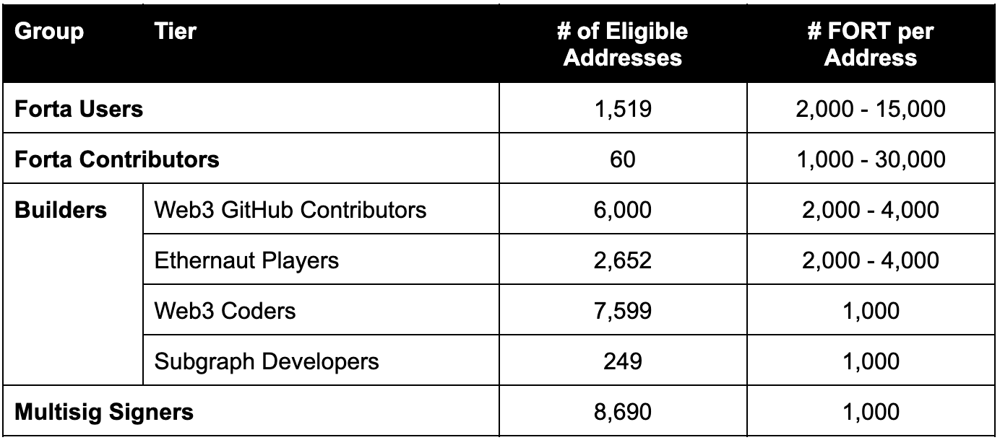
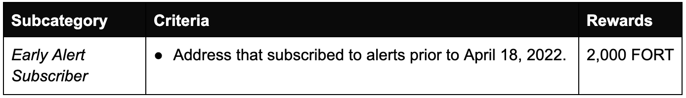
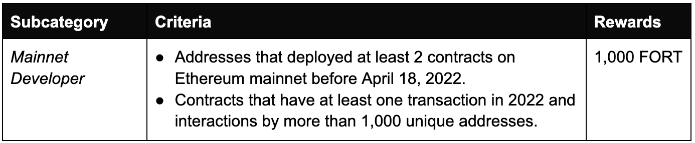
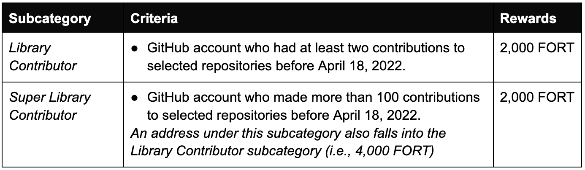
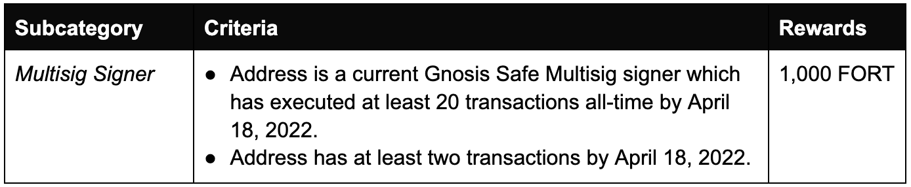

# FORT Airdrop

<h2>It's Time to Protect Web3</h2>

Read the Forta Airdrop announcement [here](https://forta.org/blog/fort-airdrop/).

The FORT Airdrop rewards early Forta contributors and seeds the broader Web3 security community with FORT tokens so they can begin building on the Forta Network. 26,022 addresses are eligible to claim FORT Tokens in the Forta Airdrop, including four key groups: Forta Users, Forta Contributors, Builders, and Gnosis Safe Signers.

Each category and subcategory is discrete and cumulative: an address can be eligible for multiple categories and allocated a sum of tokens for each accordingly. The allocation and criteria are broken down as follows:

## Forta Airdrop Allocation

## Forta Users

Forta Users, in the context of the airdrop, are those who have contributed to the Network from day one, including, but not limited to, detection bot developers, community members who participated in detection bot development contests, alert subscribers, and Forta scan node runners. 

### Detection Bot Developers

Detection Bot developers represent a critical aspect of the Network by building novel and clever ways to monitor blockchain activity. Thanks to their ideas identifying needs and leveraging their unique skills for development, a wide range of security and operational activities are now being monitored by the Forta Network.

*Each subcategory is discrete and cumulative: an address can be eligible for multiple and allocated a sum of tokens accordingly.*

### Alert Subscribers

This group selects early adopters who started using Forta by subscribing to alerts on the Forta Network. 

### Node Runners

Node runners are crucial to the Network’s security and growth by operating the infrastructure that scans transactions and emits alerts. These early community members played a key role in hardening, stress-testing, and scaling Forta.

*Each subcategory is discrete and cumulative: an address can be eligible for multiple and allocated a sum of tokens accordingly.*

## Builders

These are those who have created or contributed to key aspects of Web3’s infrastructure and security. This includes, but is not limited to, Ethereum mainnet developers, library contributors, Ethernaut players, and Subgraph developers. 

### Mainnet Developers

Inspired by [Project Galaxy’s initiative](https://blog.galaxy.eco/project-galaxy-announces-shadowy-super-coder-nft-pack-with-300-million-worth-of-perks-c5cb9ea2d18a) to support innovative developers, top developers in the Ethereum ecosystem are eligible for the FORT Airdrop. These are defined as those who deployed smart contracts with the most active interactions. 

### Library Contributors

This group includes developers who actively contributed to the over 900 eligible [Web3 GitHub repositories](https://docs.google.com/spreadsheets/d/1VgLQIiceycJf0i6gofPTWi05UCfJJ4PURBEvkSCLG-E/edit?usp=sharing) (including Web3 libraries, public goods, and top projects on chains that Forta supports). Thousands of people worked to build and maintain these projects over the years, some even working completely for free in an effort to create a better and safer decentralized economy.

*Each subcategory is discrete and cumulative: an address can be eligible for multiple and allocated a sum of tokens accordingly.*

### Ethernaut Players

[Ethernaut](https://ethernaut.openzeppelin.com) is an open source foundational learning tool teaching thousands of developers the basics of smart contract security. Fans of Ethernaut have gone on to build and audit protocols, securing billions in TVL by incorporating the critical security concepts introduced in Ethernaut.

*Each subcategory is discrete and cumulative: an address can be eligible for multiple and allocated a sum of tokens accordingly.*

### Subgraph Developers

The Graph Protocol subgraph developers are valuable contributors to Web3, facilitating access to blockchain data for decentralized applications on Ethereum. 

## Multisig Signers 

Multisig signers can be key decision-makers, DAO leaders, and/or builders that have access to large pools of assets or control over critical protocol functions. 

## Forta Contributors

Forta Contributors are ambassadors and thought leaders who are strong proponents of Forta’s mission and have contributed to the development and advancement of the network in a meaningful way.

## Malicious Actor Filtering

In an effort to reward benevolent Forta Network participants, Forta filtered out blocklisted addresses involved in any malicious activities.

- Known exploit addresses were filtered out. 
- Addresses listed in [Hop Protocol’s Airdrop Sybil Attacker List](https://github.com/hop-protocol/hop-airdrop/tree/master/src/data/blacklists) were excluded. 
- Addresses listed in [Optimism’s Airdrop Sybil Filter](https://docs.google.com/spreadsheets/d/1kUAt-vrkID0yBkic72djWRxdliK8W_5rBGxq6-Iv3cg/edit#gid=822397105) were excluded.
- Addresses listed in [Chainalysis Sanction Oracle Contract](https://go.chainalysis.com/chainalysis-oracle-docs.html) were excluded.

## What’s Next?

To check your eligibility for FORT Airdrop, visit the [Forta Airdrop page](https://airdrop.forta.network). It is not possible to claim your tokens yet – follow [@FortaNetwork](https://twitter.com/fortanetwork) for official updates on the upcoming airdrop date.

If you weren’t eligible in this FORT Airdrop, there are plenty of other ways to contribute to the Forta ecosystem even before the Permissionless Launch:

- [Get started](https://forta.org/developers/) with bot development
- [Monitor](https://app.forta.network/) your wallets and contracts
- [Start a discussion](https://gov.forta.network/) in the Forta Forum
- [Contribute](https://github.com/forta-network) to the protocol on GitHub
- [Check out](https://boards.greenhouse.io/forta) full-time roles in the Forta ecosystem

Finally, make sure to join the Forta [Discord](https://discord.com/invite/fortanetwork), follow Forta on [Twitter](https://twitter.com/fortanetwork), and subscribe to the Forta [Newsletter](https://forta.substack.com/) so you never miss an update!