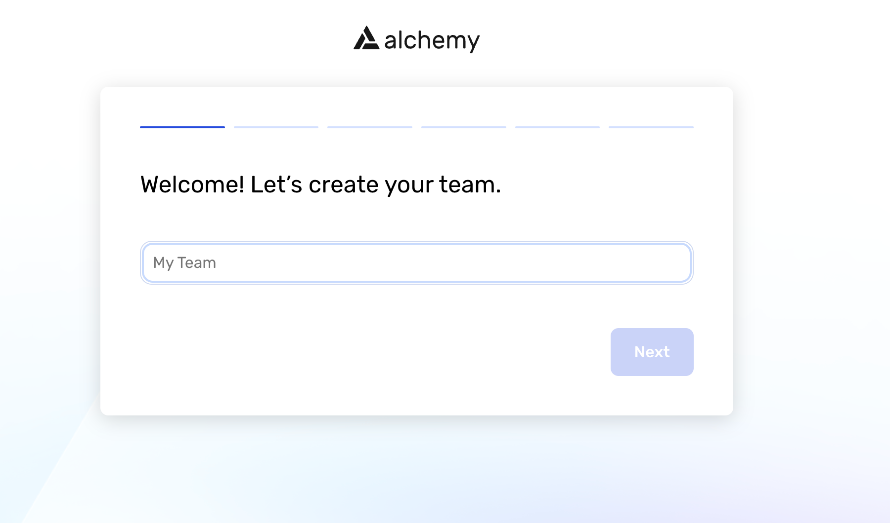
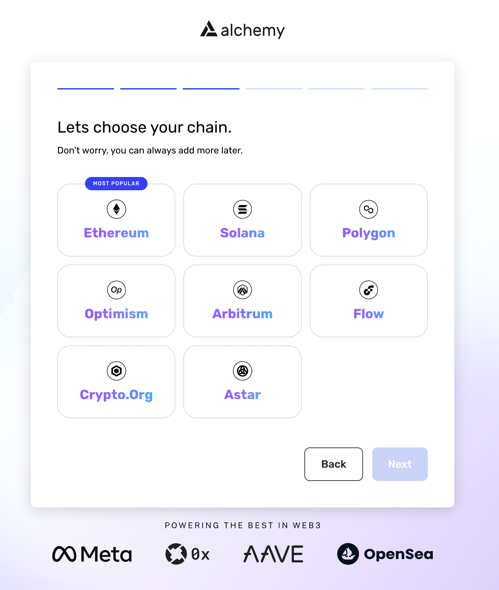
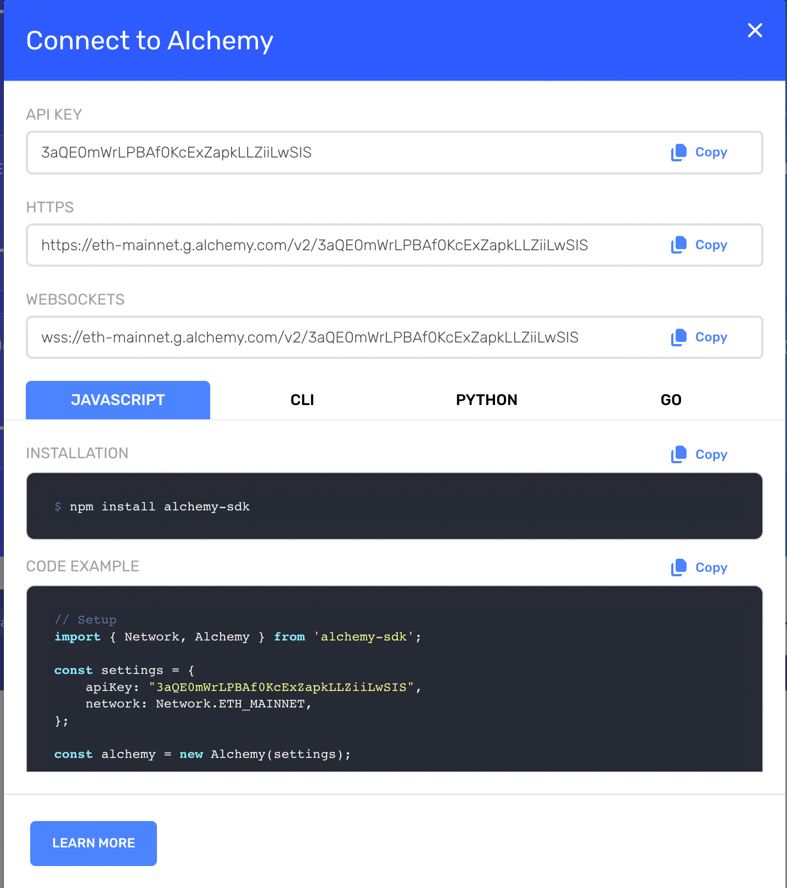

# Scan With Alchemy

## Why use Alchemy?
Alchemy is the leading web3 blockchain development platform embedded with powerful tools to simplify dApp development, saving countless hours for web3 engineers. Using Alchemy to run your Forta nodes will grant you the accuracy, reliability, and data consistency of Supernode, the proprietary blockchain engine used by leading web3 companies like OpenSea, Meta, Adobe, and Sushi Swap.

Before digging deeper into setting up your node using Alchemy, let’s explore what is Supernode and why it’s the most reliable solution to run your Forta scan nodes.

## Alchemy Supernode
Alchemy Supernode is the most widely used Ethereum API with all the functionality of a node, but with supercharged reliability, data accuracy, and scalability.

There are 5 main points that make Supernode a game-changer when it comes to serving blockchain data, faster and more reliably:

- It ensures that your data is always correct, real-time, and in sync thanks to a proprietary coordinator service.
- It powers each piece of node functionality with a dedicated, distributed system -- the same systems used by Facebook and Amazon for achieving massive scale.
- It scales quickly and seamlessly to maximize your scanning throughput.
- It includes enhanced API methods and upgraded WebSockets to continuously listen for changes and automatically handle reconnection and backfilling missed events.
- It’s a one-line infrastructure API that not only does all the jobs of a single node, but also comes with the uptime, availability, and necessities to run a production application.

If you want to read more about how Supernode is helping developers scale their applications, [here are a number of use cases](https://www.alchemy.com/supernode) you might find interesting.

Now that we know how Alchemy helps your Forta nodes be more reliable and performant, let’s dive into how to create a new Alchemy account completely for free.

If you already have an Alchemy account, feel free to skip the next section.

## *Special Offer*
Now that we know how Alchemy helps your Forta nodes be more reliable and performant, let's dive into how to create a new Alchemy account completely for free.

If you want to run your nodes at maximum speed, Alchemy also offers a special price for frens in Forta's community, that comes with full support for:

- *Alchemy Testnet APIs*
- *Alchemy Supernode for Mainnet*
- *Alchemy Notify*
- *Alchemy Monitor*
- *Alchemy Build*
- *Enhanced APIs and Websockets*
- *Standard Throughput - 660 compute units/second*
- *Dashboard access (10 user licenses included)*

[Redeem your discount here!](https://alchemy.com/?a=forta&promo=ALCHEMY_FORTA_10_T351FA2)

## Create a new Alchemy Account

To start using Alchemy as a node provider for our Forta node, you’ll need to create a new account. 

Head to [alchemy.com](https://alchemy.com/?a=forta&promo=ALCHEMY_FORTA_10_T351FA2) and click on the sign-in button to register.




Next, specify the type of project you want to build:


Then, select the chain you want to scan:



You’ll then be prompted to insert your credit card info, or skip the form to be redirected to the Alchemy Dashboard:


From here, you’ll need to grab the RPC URL required to set up your Forta node. On the Alchemy dashboard, click on the “My Team’s App”:


Then, click on the “View Key” button to reveal your API Key:



Now that you have your HTTPS RPC URL, we’ll need to connect Alchemy Supernode to the Forta scan node running on your terminal.

## Configure your Alchemy Chain APIs
If you haven’t already installed Forta on your terminal, make sure to go through the [quickstart guide](scanner-quickstart.md) for kickstarting your Forta scan node.

Once your Forta directory has been initialised, you’ll find a file named  `config.yml`. We’ll need to configure that file so that our scan node knows how to pull data from the blockchain.

Forta detection bots are able to call JSON-RPC APIs using the RPC endpoints and the chain ID configured  in the `config.yml` file, to do so, we’ll need to initialize the `scan.jsonRpc.url`  property in the config.yml file, with the Alchemy RPC URL we got when we created our Alchemy DApp in the previous section.

Open the config.yml file in your Forta directory, and copy your Alchemy RPC URL in the jsonRpc property:

```
chainId: 1

scan:
  jsonRpc:
    url: https://eth-mainnet.alchemyapi.io/v2/KEY

trace:
  jsonRpc:
    url: https://eth-mainnet.alchemyapi.io/v2/KEY
```

That’s it! Your Forta node will now scan blockchain transactions at lightning speed using Alchemy Supernode! 

Please note that we’ve set the chainId property to one in the above code. This is because we provided guidance to create an Ethereum application, and the Ethereum Mainnet chain ID is one. 

If you want to scan other chains like Polygon, Arbitrum or Optimism, please refer to the following section! 

## Scanning other chains
If you want to scan other chains beyond Ethereum Mainnet using Alchemy, you’ll need to create a new Alchemy dApp selecting the chain you want to scan, and refer to the following settings and chain ID to setup your config.yml file:

### Polygon
```
chainId: 137

scan:
  jsonRpc:
    url: https://polygon-mainnet.g.alchemy.com/v2/YOUR-API-KEY

trace:
	jsonRpc:
    url: https://polygon-mainnet.g.alchemy.com/v2/YOUR-API-KEY
```

### Arbitrum
```
chainId: 42161

scan:
  jsonRpc:
    url: https://arb-mainnet.g.alchemy.com/v2/YOUR-API-KEY

trace:
    url: https://arb-mainnet.g.alchemy.com/v2/YOUR-API-KEY
```

### Optimism
```
chainId: 10

scan:
  jsonRpc:
    url: https://opt-mainnet.g.alchemy.com/v2/YOUR-API-KEY

trace:
    url: https://opt-mainnet.g.alchemy.com/v2/YOUR-API-KEY
```
