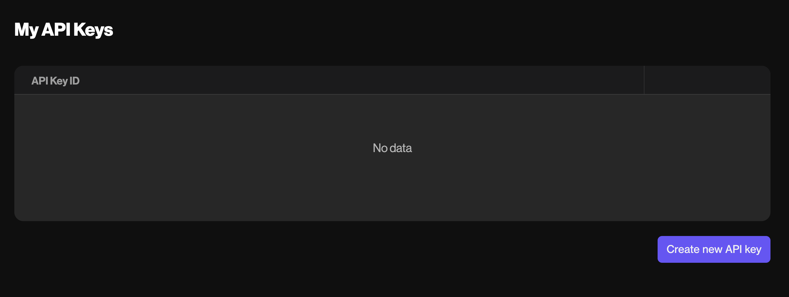

# API Keys

In order to use the Forta GraphQL API, you will need an API key.

## Creating an API Key

You can easily generate API keys using the Forta App by following these steps:

### 1. Navigate to My API Keys

After signing in with your wallet in Forta App, select the "My API Keys" option in the top right menu.


### 2. Click Create API Key

Initially you will see an empty list, but you can generate a new API key by clicking the "Create new API key" button. You will then see a modal displaying your new API key as well as a randomly generated Key ID to identify your API key. Click on the Copy button next to the API key to copy it to your clipboard.



!!! warning "Protect your API key"
    Remember to **store your API key somewhere safe** as it cannot be recovered. It should be kept secret. If you lose your API key you can always delete it from this page and generate a new one (up to a maximum of 10)

## Using the API key

In order to use the API key, you must set it as a Bearer token in the Authorization header of your HTTP request. For example, if your API key is `abc123` your header would look like `"Authorization": "Bearer abc123"`. Here is an example curl usage:

```
curl POST --header "content-type: application/json" --header "Authorization: Bearer abc123" --url "https://api.forta.network/graphql"
```
