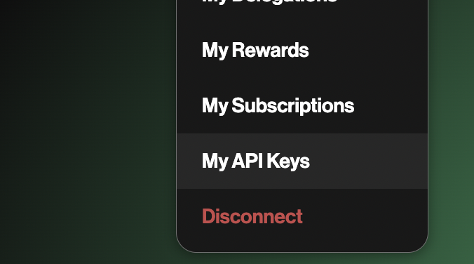
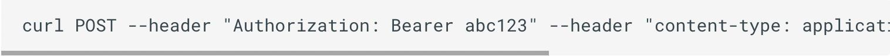
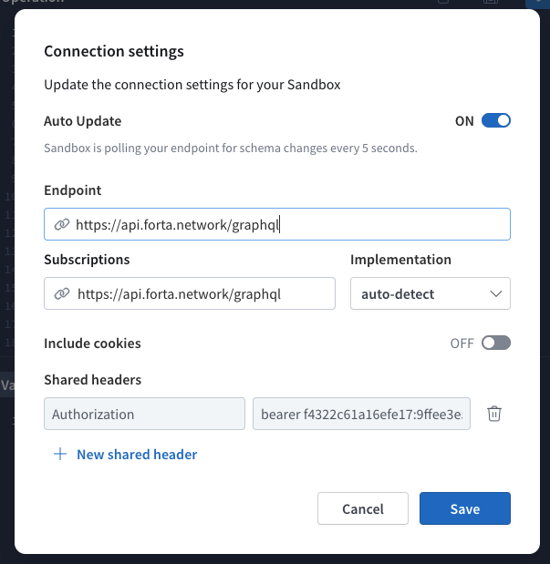
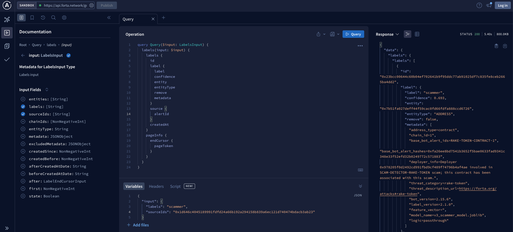
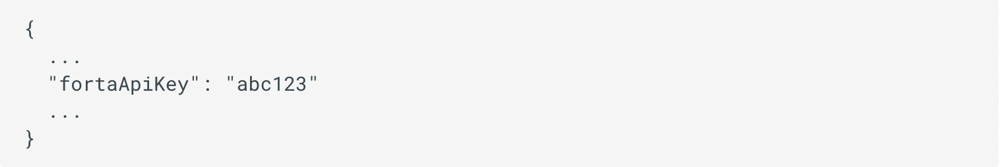

**Using the API**

Forta currently supports GraphQL API access to intelligence emitted by detection bots. Each bot’s documentation will describe the types of intelligence it generates, and will often have details about the detection methodology used. For Premium Feeds in particular, bot documentation should also feature example queries you can use to get up and running quickly. The API endpoint is [https://api.forta.network/graphql](https://api.forta.network/graphql) and an API key is required. 

Note: Your query must also include the specific bot ID(s) you want intelligence from. 

## Before you can access the API, you must:

* Purchase a Forta subscription (or been given a free trial), and
* Generate an API key

## **Generating API Keys**

To access the Forta API, [generate an API key](https://docs.forta.network/en/latest/api-keys/) using the Forta App:

### 1. Navigate to My API Keys

After signing in to the Forta App with your wallet, select the "My API Keys" option in the top right menu.

### 2. Click Create API Key

Initially you will see an empty list, but you can generate a new API key by clicking the "Create new API key" button. You will then see a modal displaying your new API key as well as a randomly generated Key ID to identify your API key. Click on the Copy button next to the API key to copy it to your clipboard.

**Using the API Key**

When querying the Forta GraphQL API directly, you must set the API key as a Bearer token in the Authorization header of your HTTP request. For example, if your API key is abc123 your header would look like "Authorization": "Bearer abc123". 

Here is an example curl usage:

**API Sandbox**

If you'd like an interactive interface for building and testing a query, please check out the [API Sandbox](https://studio.apollographql.com/sandbox?document=query%20exampleQuery%20%7B%0A%20%23%20first%205%20alerts%0A%20alerts%20%7B%0A%20%20%20%20pageInfo%20%7B%0A%20%20%20%20%20%20hasNextPage%0A%20%20%20%20%20%20endCursor%20%7B%0A%20%20%20%20%20%20%20%20alertId%0A%20%20%20%20%20%20%20%20blockNumber%0A%20%20%20%20%20%20%7D%0A%20%20%20%20%7D%0A%20%20%20%20alerts%20%7B%0A%20%20%20%20%20%20createdAt%0A%20%20%20%20%20%20name%0A%20%20%20%20%20%20protocol%0A%20%20%20%20%20%20findingType%0A%20%20%20%20%20%20source%20%7B%0A%20%20%20%20%20%20%20%20transactionHash%0A%20%20%20%20%20%20%20%20block%20%7B%0A%20%20%20%20%20%20%20%20%20%20number%0A%20%20%20%20%20%20%20%20%20%20chainId%0A%20%20%20%20%20%20%20%20%7D%0A%20%20%20%20%20%20%20%20bot%20%7B%0A%20%20%20%20%20%20%20%20%20%20id%0A%20%20%20%20%20%20%20%20%7D%0A%20%20%20%20%20%20%7D%0A%20%20%20%20%20%20severity%0A%20%20%20%20%20%20metadata%0A%20%20%20%20%7D%0A%20%20%7D%0A%7D&endpoint=https%3A%2F%2Fapi.forta.network%2Fgraphql).

**Step 1:** Make sure that the endpoint is set to [https://api.forta.network/graphql](https://api.forta.network/graphql)

If the sandbox is requesting an API key you can click on the gear logo just left of the publish button in order to insert your API key. 

Under the ‘Shared headers’ section you must insert your API key by typing in ‘bearer’ space and then pasting your API key. 

**Step 2: **Create a new workspace if a blank one does not already exist by clicking on the + button as seen in the screenshot below.

**Step 3:** On the left hand side of the screen, under the ‘Documentation’ you will see the word Query with a + next to it and a ‘Fields’ heading with several options available. Click on Query to begin populating the Operation panel. Unlike a Rest API, the GraphQL API provides you with the flexibility to choose exactly the specific data you are interested in. 

**Step 4: **Once you have clicked on Query, you will need to start populating the Operation panel with the necessary parameters required for your needs and the bot which you are querying. Certain bots emit alerts and labels. Check the bots documentation on how to query it correctly. 

After making your selections and jumping through the Documentation window your Operation window should look something like this: 

**Step 5: **Under the Arguments heading in the Documentation window is where we will start to populate the Variables panel. 

**Step 6: **Finally, we can click on the big blue Query button on the top right hand corner and our results will appear in the far right hand side of the screen. 

**Using with a bot locally**

If you have a bot that uses the getAlerts SDK method and you want to run the bot locally, you will need to provide the API key through the forta.config.json file. Simply set the fortaApiKey property in forta.config.json e.g.:

## **How can I contribute?**

If you'd like to report a bug, request a feature, or ask any questions about the API, please check out the [forta-api github repository](https://github.com/forta-network/forta-api#contribute). We will be tracking all feature requests, bug reports, and feedback there.
