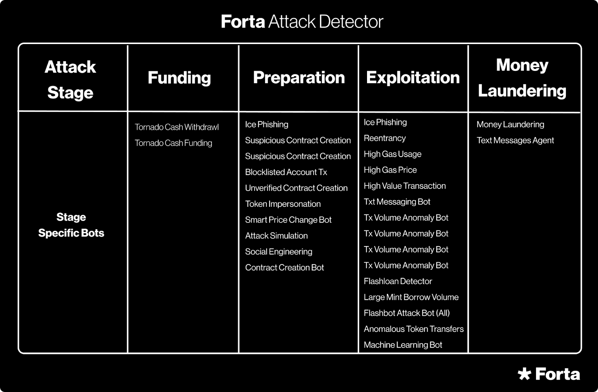

# Attack Detector Feed

| Bot Name | Bot Stats | Bot Source Code  | Supported Chains | Documentation |
|----------|-----------|------------------|------------------|---------------|
| Attack Detector | [Stats](https://explorer.forta.network/agent/0x80ed808b586aeebe9cdd4088ea4dea0a8e322909c0e4493c993e060e89c09ed1) | [Github Repo](https://github.com/forta-network/starter-kits/tree/main/alert-combiner-py) | All | [Docs](https://ipfs.forta.network/ipfs/QmW776kaGG2AWq2E8Z15LwS1afTrACV5XPbVH9YjkNhDUR) |

Combines past alerts under a common address from a variety of underlying bots to emit a high precision alert. It does so by mapping each alert to the four attack stages (Funding, Preparation, Exploitaiton and Money Laundering) applying a variety of heuristics (e.g. an alert has to exist for each of the four stages) to emit an alert.

Individual alerts can have low precision; in other words, raise false positives. This bot combines past alerts to separate the signal from noise. 

It does so with the realization that an attack usually consists of 4 distinct phases:
1. funding (e.g. tornado cash funding)
2. preparation (e.g. creation of an attacker contract)
3. exploitation (e.g. draining funds from a contract)
4. money laundering (e.g. sending funds to tornado cash)

As such, the detection bot combines previously raised alerts under the initiating address (i.e. the attacker address) for a given time window (2 calendar days, so between 24-48h) and emits a critical alert when alerts from all four phases have been observed or a certain combination of the first two stages (i.e. funding with tornado cash and attack simulation fired, or if the Attack Simulation bot triggers on the preparation phase).

The following bots are considered by the Attack Detector and mapped to the stages in the following way:

As a result, the precision of this alert is quite high, but also some attacks may be missed. Note, in the case where attacks are missed, the broader set of detection bots deployed on Forta will still raise individual alerts that users can subscribe to.

## Supported Chains

All Forta supported chains (note, it will appear that the bot only executes on one chain, but as it queries past Forta alerts, it essentially covers all chains)

## Alerts

Describe each of the type of alerts fired by this bot

### ALERT-COMBINER-1

- Fired when alerts mapping to all 4 stages under one common EOA (the attacker address) have been observed
- Severity is always set to "critical" 
- Type is always set to "exploit" 
- Metadata will contain the date range when attack took place, the attacker address, a list of detection bots that triggered that were utilized by this detection bot to make a decision as well as any of the transactions and addresses that were mentioned in any of the underlying alerts

Note: the block number that will be reported as part of this alert may be unrelated to the alert, but represents more of a timestamp on when the attack was discovered.

Note: the detection bot will only alert once per EOA observed

### ALERT-COMBINER-2

- Fired when alerts mapping to funding and preparation stages (attack simulation bot needs to fire) under one common EOA (the attacker address) have been observed
- Severity is always set to "critical" 
- Type is always set to "exploit" 
- Metadata will contain the date range when attack took place, the attacker address, a list of detection bots that triggered that were utilized by this detection bot to make a decision as well as any of the transactions and addresses that were mentioned in any of the underlying alerts

Note: the block number that will be reported as part of this alert may be unrelated to the alert, but represents more of a timestamp on when the attack was discovered.

Note: the detection bot will only alert once per EOA observed

## Test Data

The bot behaviour can be verified with the following blocks (assuming a default time window):

- Fei Rari - block number 14685062 (date range: April 29-30 2022) (only works on version 0.6 and prior)

