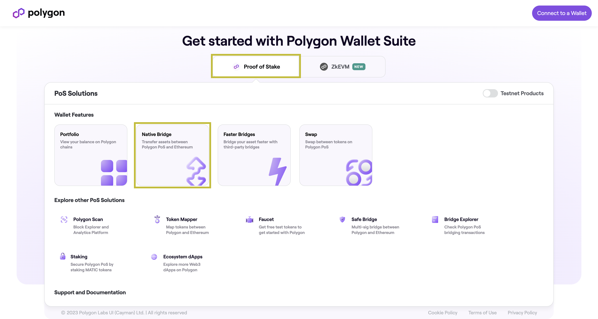
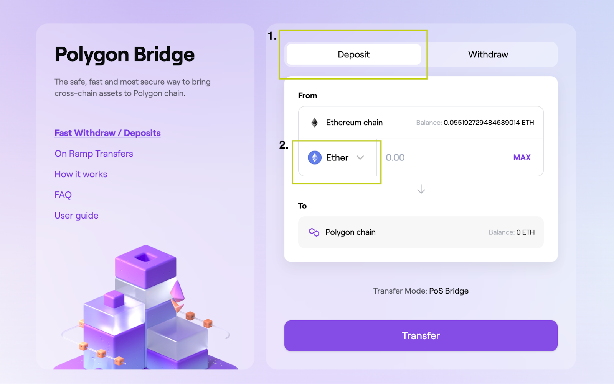
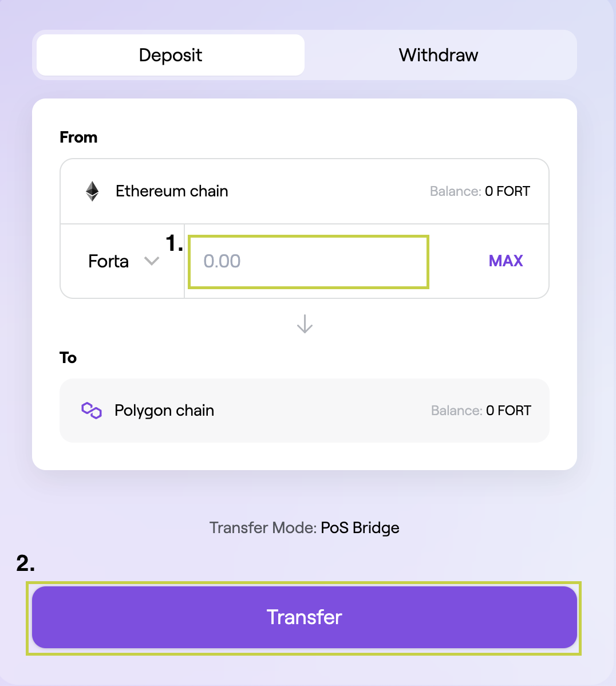

# Bridging FORT tokens

You may need to bridge your FORT tokens from Ethereum to Polygon in order to stake on scan nodes or detection bots. This page will describe how to bridge your FORT tokens.

1. Go to [https://wallet.polygon.technology/](https://wallet.polygon.technology/) and click on Polygon Bridge
   
2. Log in by connecting your wallet
   
3. Click "Deposit" and then click the dropdown list of tokens
   
4. You may see the FORT token is not displayed. Click on "Manage token list"
   
5. Click on "Tokens", paste the FORT contract address (0x41545f8b9472D758bB669ed8EaEEEcD7a9C4Ec29) and then click "Add FORT"
   
6. You will now be able to find FORT in the list of tokens. Click on FORT
   
7. Select the amount of FORT you want to bridge and then click "Transfer" to bridge your tokens to Polygon
   
8. Wait for the bridge transaction to be completed and you will get the assets in the FORT contract address in Polygon (0x9ff62d1FC52A907B6DCbA8077c2DDCA6E6a9d3e1)
