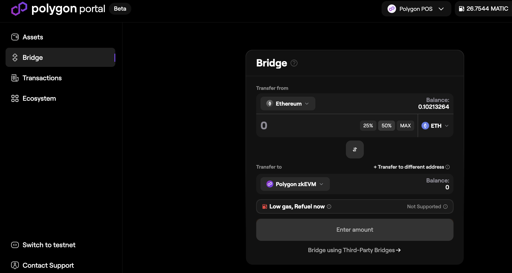
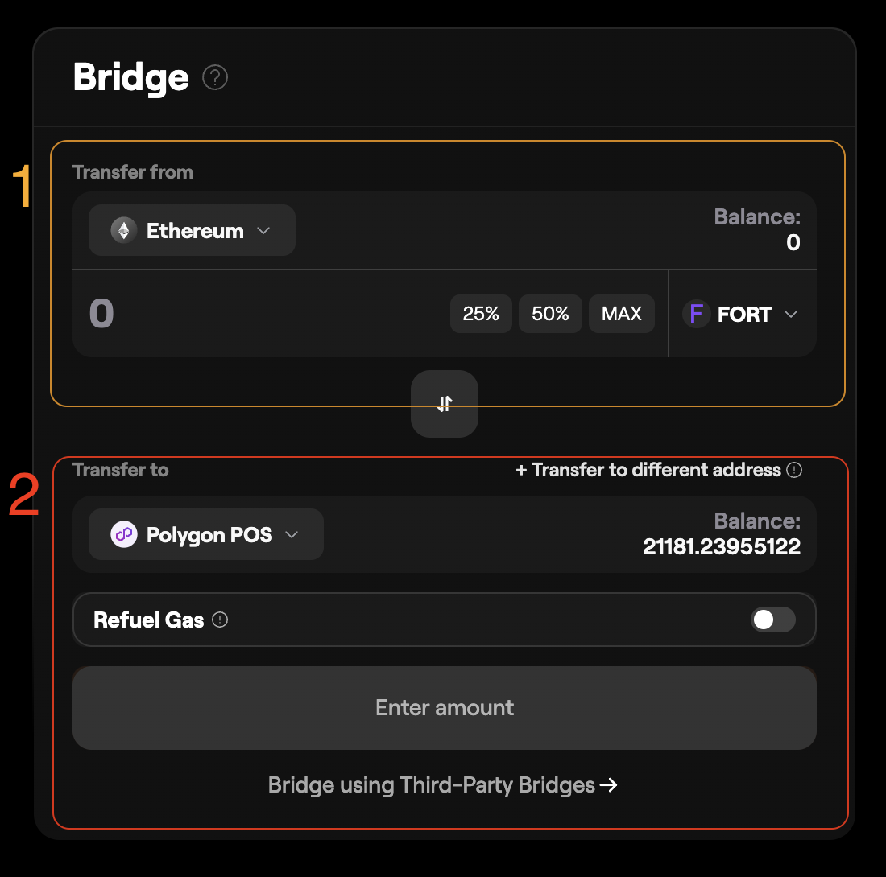
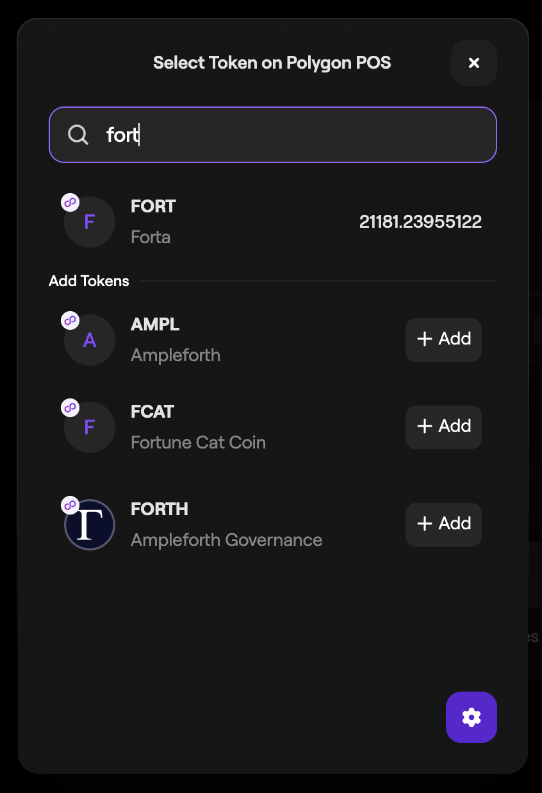
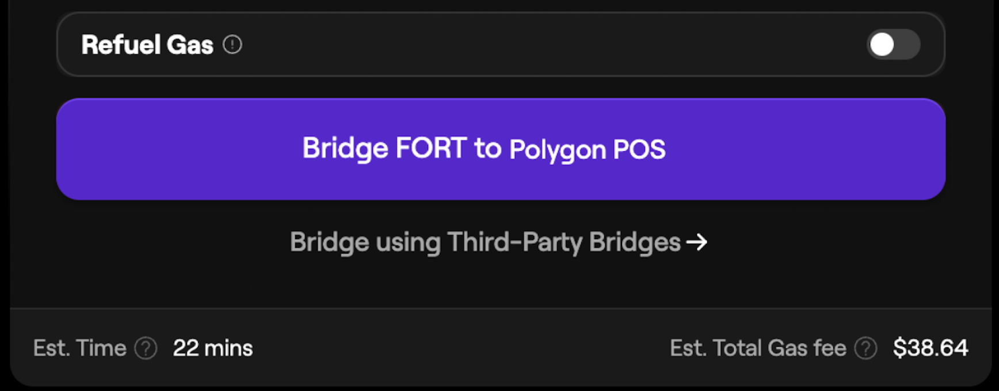

# Bridging FORT tokens

You may need to bridge your FORT tokens from Ethereum to Polygon in order to stake on scan nodes or detection bots. This page will describe how to bridge your FORT tokens.

1. Go to [https://portal.polygon.technology/](https://portal.polygon.technology/) connect your wallet and click on **Bridge** in the left side menu.

2. Here is where you will be able to configure your token transfer. Make sure that the **Transfer From** section (indicated as num. 1 in the diagram below) is set to Ethereum. Select the **FORT** token from the bottom right, you may need to search for the token here. Then enter the total number of FORT tokens you wish to bridge over. The **Transfer To** section (indicated as num. 2 in the diagram below) must be set to **Polygon POS**.

**Please Note:**
**DO NOT** bridge your FORT tokens over to Polygon zkEVM.
You must have some ETH in your wallet in order to pay the gas fee. 
The correct contract address for the FORT token on Ethereum is 0x41545f8b9472D758bB669ed8EaEEEcD7a9C4Ec29.
The correct contract address for the FORT token on Polygon is 0xd2863157539b1D11F39ce23fC4834B62082F6874.

3. Once you have your configuration complete, click on the large purple button at the the bottom that says **"Bridge FORT to Polygon"**. Confirm the transaction within your wallet UI. Once the transaction is complete you can begin delegating your FORT to the Forta Network.

Please Note: 
Bridging transactions can take around 30 minutes on average to complete. Do not be alarmed if you don't see your FORT tokens on Polygon immediatley. 

Navigate web3 with confidence by [adding the Forta Network Metamask Snap to your wallet](https://snaps.metamask.io/snap/npm/forta-network/metamask-snap/). Learn more about how to protect yourself from scam with Forta [here](https://docs.forta.network/en/latest/Forta-for-Metamask/).
