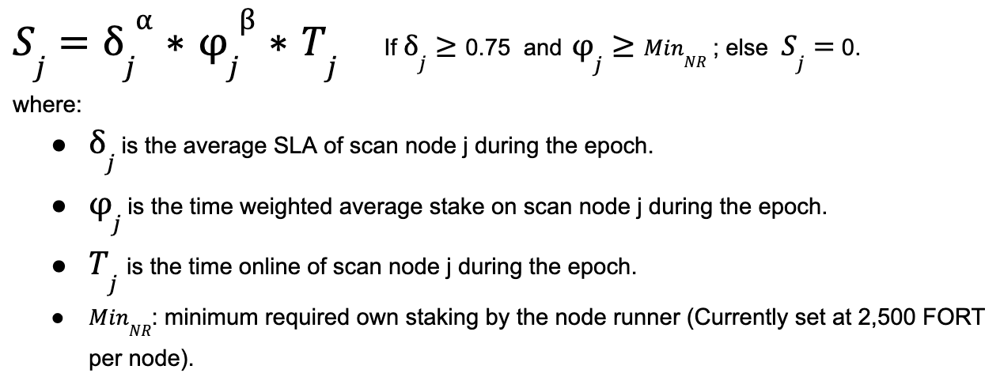
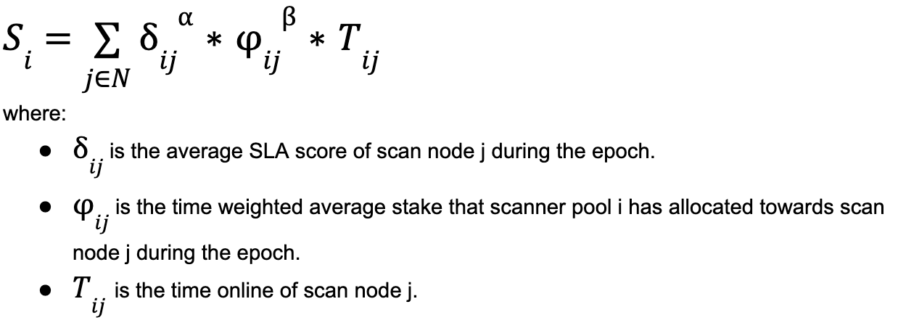
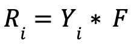
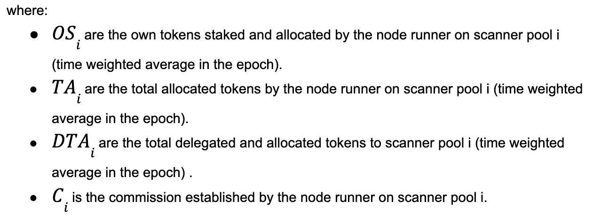

# Delegated Staking Rewards Formula

With the introduction of delegated staking, there are new reward formulas for pool owners and delegators. These formulas seek to

- encourage node runners to ensure the reliability and performance of the Forta network by achieving the highest possible SLA scores in their nodes,
- encourage node runners and delegators to stake more and increase the economic security of the network. 

The approach involves distributing rewards to participants by using a function of the

- SLA score,
- deposited stake,
- time online,

using the Cobb-Douglas production function.

!!! important "Important definitions"
    - **epoch duration**: 1 week, from Monday 00:00:00 UTC to Sunday 23:59:59 UTC
    - **commission lockdown after any change**: two epochs (excluding the current one)

    These values subject to change.

The score of scan node `j` during an epoch is:

Consequently, the total score of scanner pool `i` during an epoch is:

And the share of the rewards scanner pool `i` receives during an epoch is:

Consequently, the total amount of rewards allocated to scanner pool `i`, during an epoch is:

where `F` is the total amount of FORT rewards to all of the Forta scan nodes during the epoch.

Finally, the total amount of rewards allocated to scanner pool `i` is divided between the node runner of that pool and all the delegators to it:

Node runner rewards on scanner pool `i`: 

Delegator rewards on scanner pool `i`:
 

The values of parameters α and β are set to 3 and 0.5 respectively and are subject to change in the future.

Delegator rewards are distributed to each delegator proportionally to their deposited stake.
