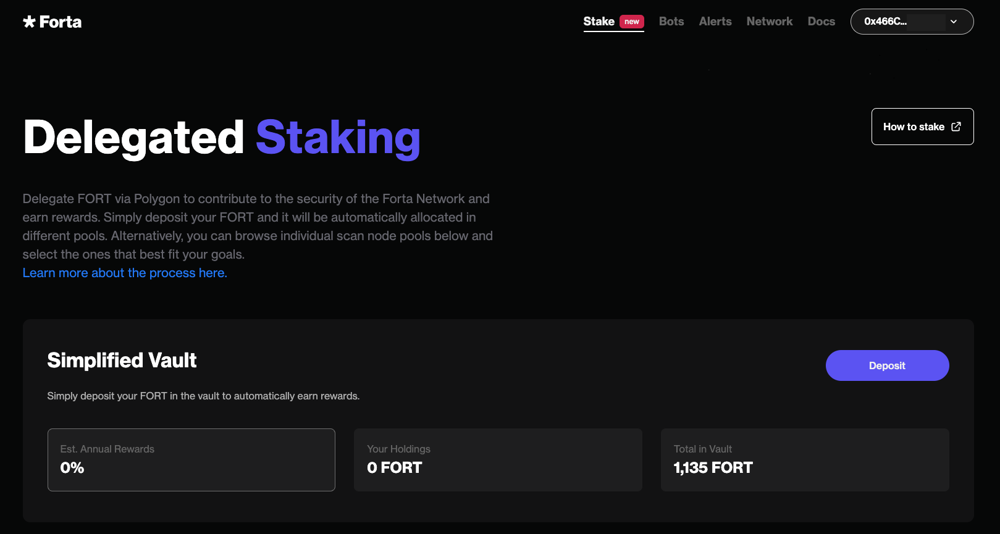
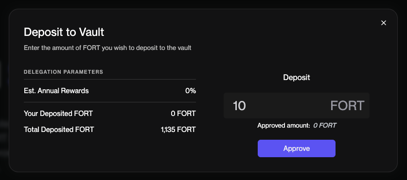
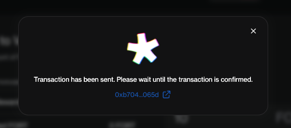
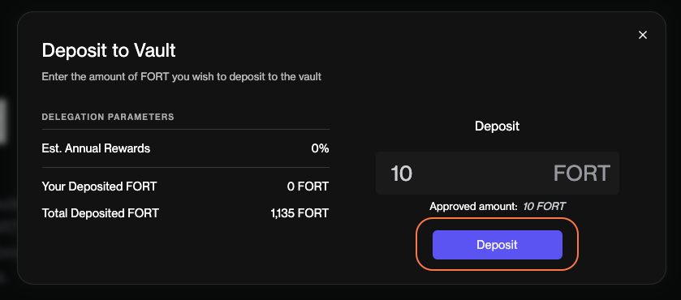
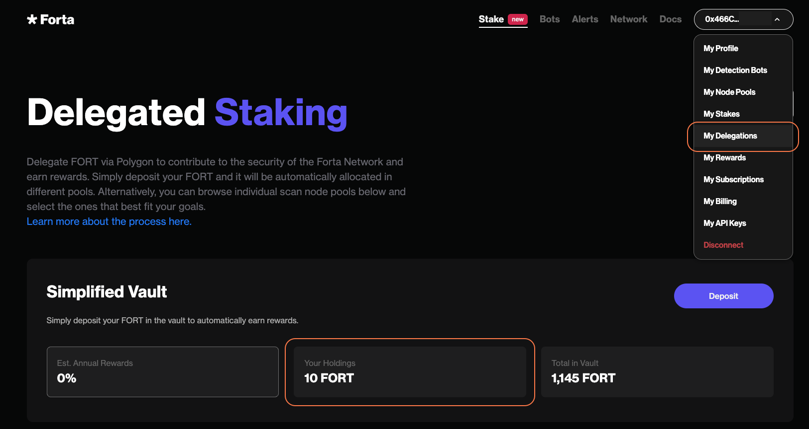
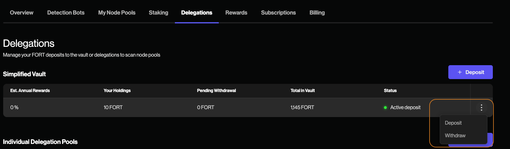

# Deposit Your FORT in the Token Vault via Forta App

The FORT Vault is a simple and streamlined way to contribute your FORT tokens to securing the Forta Network. The vault allows you to simply deposit FORT tokens into the vault and rest is taken care of for you. Start earning rewards for your contribution without having to choose and decide between different individual pools. 

1. Make sure your FORT is on the Polygon network. If you have your FORT on Ethereum Mainnet, follow [these steps](https://docs.forta.network/en/latest/bridging-fort/) to bridge it to Polygon. 

2. After connecting your wallet, navigate to the **stake** button on the top of the Forta App. Here you can deposit your FORT tokens into the vault. 

Click on **Deposit** and choose the amount of FORT tokens you want to approve by clicking **Approve**, then confirm the transaction from within your wallet. 

After your approval transaction is confirmed, click the **Deposit** button and approve the transaction from within your wallet. 

3. In this view you can review the total amount of FORT you have deposited in the vault, the overall total amount of FORT in the vault and the current estimated annual rewards. 

4. Navigate to the **My Delegations** page from the top right of the Forta App. Here you can track the total amount of FORT you have deposited in the vault, the total amount of FORT deposited in the vault and the current estimated annual rewards. Additionally, here you will be able to deposit more FORT or withdraw any amount of FORT you wish to withdraw. 
	

## Withdrawing from the FORT Token Vault and Claiming Rewards

Initiating a withdrawal request from the FORT Vault will result in a percentage amount of FORT returned to you at the time of withdrawal based on the availability of liquidity in the vault. To claim the remaining FORT, you must wait the **10 day cooling off period** to initiate a withdrawal transaction for the remainder of your FORT tokens. 

Rewards are automatically included in your total FORT deposit amount and will continue to grow.  
