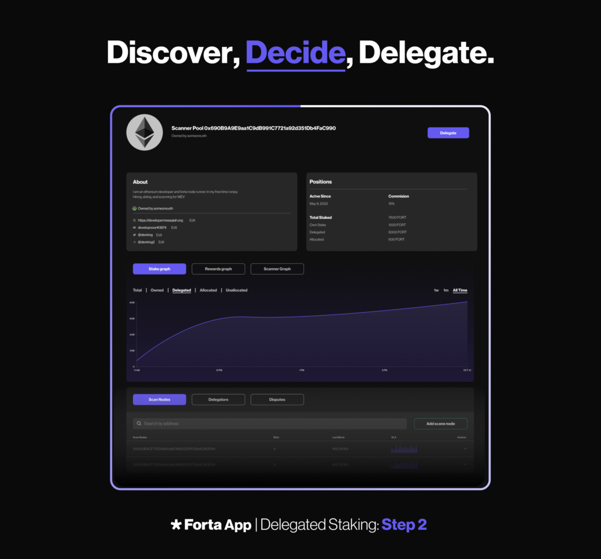
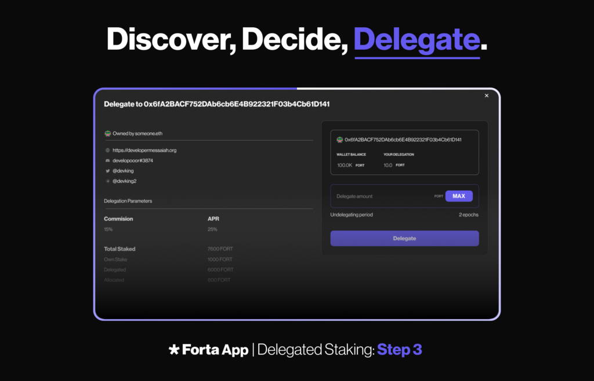

# Delegate Your FORT Using the Forta App

Delegated staking is an essential part of the Forta Network, and choosing the right scanner pool is crucial if you want to maximize your potential for rewards. This guide will walk you through the process of choosing a scanner pool, depositing stake, and withdrawing stake using the Forta App. As always, you can also interact with the smart contracts directly on Polygon.

## Choosing a Scanner Pool

To choose a scanner pool, you can visit the [pools page](https://app.forta.network/network/node-pools) in the Forta App and consider the following factors:

1. **Yield Score:** This is the output of a formula (APY Pool_i = {1 + ( LastEpochRewardsForDelegators_i / LastEpochDelegatorsTotalStake_i )} ^ 52 -1) that nodes and other community members have found helpful when thinking about potential rewards from delegation. The formula extrapolates potential rewards on an annual basis, based on the pool’s rewards from the last epoch.
 
2. **SLA Score:** Higher SLA scores in an epoch result in higher rewards. This metric is viewable in each pool profile.

3. **Uptime:** More time online in an epoch results in higher rewards. This metric is viewable in each pool profile.

4. **Commission:**  Lower node commissions result in higher rewards for delegators. Note that pool owners can modify their commissions periodically each epoch.

5. **Available stake allocation capacity:** Unallocated stake does not generate rewards.

Remember to monitor your delegations and engage with the Forta Discord community to identify reputable Pool Operators. Although the factors above may inform your decision, they are based on past performance and are no guarantee about future results.

## Depositing Stake
Delegated stake must be deposited to make scan nodes operational and generate rewards.

### Delegating to a Pool
1. Discover a node pool on the [pools page](https://app.forta.network/network/node-pools?search=&sorting=-apyForLastEpoch&page=0) with a node and enough stake to accommodate your desired delegation amount.

2. Navigate to the node pool page by clicking on the pool id.

3. Click the "Delegate" button.

4. Approve the amount of FORT to delegate with your wallet and wait for the transaction to confirm.

5. Delegate the approved FORT with your wallet and wait for the transaction to confirm.

Of course, you can also always interact with the smart contracts directly on Polygon.

### Depositing on Your Own Pool

1. In the Forta App, navigate to "My Node Pools."

2. Click on the node pool you want to add stake to.

3. Click "Add Stake."

4. Approve the amount of FORT to stake with your wallet and wait for the transaction to confirm.

5. Stake the approved FORT with your wallet and wait for the transaction to confirm.

## Withdrawing Stake
To withdraw your stake, navigate to the "My Stakes" page from the top right menu. Please note that there is a 10-day lockdown period for stake withdrawal.

For detailed instructions on how to delegate your stake to a scanner pool and withdraw your stake using the Forta App, visit the [pool and stake management](https://docs.forta.network/en/latest/scanner-pools/) page.

### Claiming Rewards
To claim rewards, visit the "My Rewards" page from the top right menu of the Forta App. You check on the rewards page to see if you have any available rewards and claim rewards from multiple epochs with single action.

Reward calculation starts after the end of each epoch (Monday 00:00:00 UTC). Rewards are written to the rewards distributor contract as soon as the calculation is completed. As soon as the rewards are available in the contract, pool owners and delegators can claim their portion of reward via the Forta App. If you wish to collect rewards manually via Polyscan, you can follow the guide [here](https://docs.forta.network/en/latest/delegated-staking-rewards/#claiming-rewards).