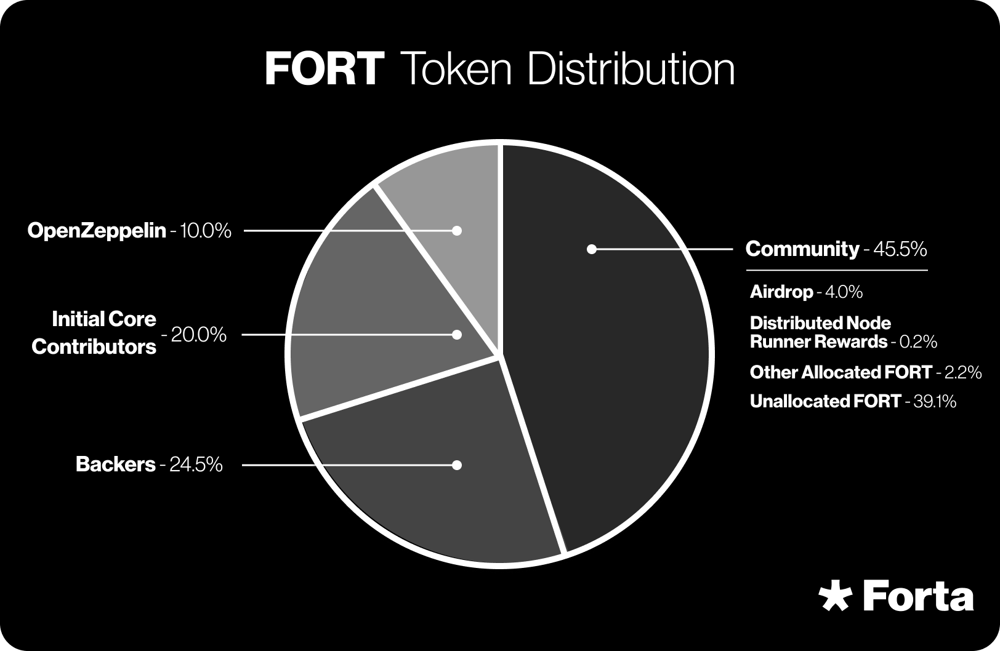
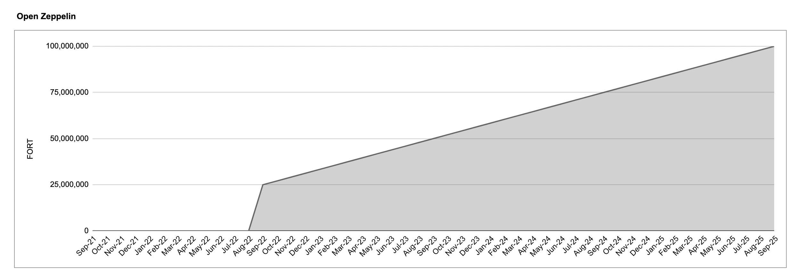

# FORT Token

FORT is an ERC-20 token in the Ethereum network. 
Address: *0x41545f8b9472D758bB669ed8EaEEEcD7a9C4Ec29*

Staking is only available in Polygon, so anyone who wants to stake needs to bridge FORT to Polygon to do so ([https://wallet.polygon.technology/](https://wallet.polygon.technology/)), or acquire FORT tokens directly in Polygon. FORT’s address in Polygon is: *0x9ff62d1FC52A907B6DCbA8077c2DDCA6E6a9d3e1* 

## How is the FORT token used in Forta?

To ensure the accuracy and integrity of the data provided by the network, Forta adopts a work token model, where both scan node pools and detection bots must have FORT staked above a minimum requirement. This acts as an economic security mechanism of their actions in their network, as the stake can be slashed if participants act maliciously.

FORT has the following primary uses that are indispensable to the proper functioning of the network:

1. **Scanner Pool Staking:**
    1. **Scanner pool owners** must deposit FORT tokens on their pools to be discoverable in the network and to provide economic security for the work they are performing, since the staked FORT can be slashed if nodes fail to execute their assigned work or perform their work maliciously. Once FORT is staked, it may only be withdrawn subject to a thawing period, which provides ample opportunity for verification and dispute resolution.

    2. **Delegators** may also stake on a pool, with the same withdrawal restrictions. The Delegators may face a smaller percentage of deduction from the stake in case the pool gets slashed.

  
2. **Detection Bot Staking:** Developers must stake FORT tokens on bots, signaling bot quality to the network and also providing a sybil resistance mechanism.

 3. **Payment of Data Fees:** Users who want to buy Forta’s General Plan to consume data from the network must pay a monthly fee, denominated and paid in FORT. In addition, premium feeds can be denominated and paid either in FORT or in USDC, subject to the feed owner’s decision.

 4. **Governance:** FORT holders can participate in the governance of the Forta Network, helping shape its evolution by voting on key proposals that impact protocol upgrades, economic policies, and ecosystem initiatives.

In addition, FORT holders can participate in governance to shape the evolution of Forta. Please read more in the governance section of the docs.

## Token Distribution

The total supply of FORT tokens has been capped at 1,000,000,000 FORT.

## Community Allocation

The FORT Community Allocation is held by the Forta Foundation and is not subject to a specific vesting or distribution schedule.

As of August 2023, less than 45 million FORT have been distributed to community members and above 41% of FORT’s total supply is still held by Forta Foundation in the community treasury. Tokens that were distributed belong to: [rewards to node pools](https://forta.notion.site/Rewards-from-previous-weeks-38b0a37299d841f8946f2f1fbcbdeeb4), [FORT’s airdrop to early community members and builders](https://forta.org/blog/fort-airdrop/), [rewards to node operators during Fortification phase](https://forta.org/blog/1000-nodes/), and grants to community developers under the Threat Research Initiative (TRi) program, to developers under [Gitcoin grants](https://forta.org/blog/100000-fort-pledged-to-gitcoin-grants/) and Gitcoin bounties programs, to community contributors like [Blocksec](https://forta.org/blog/blocksec-and-forta-work-to-secure-web3-beyond-audits/) and [Nethermind](https://forta.org/blog/nethermind-wants-to-see-the-heartbeat-of-ethereum-security-on-forta/), to [universities such as OSU and UCSB for academic threat research funding](https://forta.org/blog/investing-in-applied-academic-threat-research/), and to [audit firms such as MixBytes, ChainSecurity and OpenZeppelin](https://forta.org/blog/top-audit-firms-highlight-real-time-monitoring/), among other grants.

## Other Allocations

Other FORT token allocations include tokens held by Backers, Initial Core Contributors, and OpenZeppelin. All three groups are subject to transfer restrictions that are removed according to 4-year linear vesting periods with a 1-year cliff. FORT tokens allocated to these groups began vesting on September 1, 2021 and will be fully transferable by September 1, 2025.

### Early Backers Allocation

The Forta Network received early support from a group of dedicated backers who not only provided funding for the development of Forta, but also became some of the earliest members of the Forta community, providing key networking and support across various functions. Backers also represented some of the first node operators in the Forta Network. Backers’ transfer restrictions are enforced through on-chain vesting smart contracts. 

Early backers of the Forta Network played a critical role in supporting its development, providing funding and strategic support for the network’s initial growth. Their allocation represents **24.5% of the total FORT supply** and is subject to **4-year linear vesting with a 1-year cliff**, enforced through on-chain vesting smart contracts. Vesting commenced on **September 1, 2021**, and tokens will be fully unlocked by **September 1, 2025**.

This allocation is composed of two funding rounds:

**2021 Funding Round**

In **2021**, Forta raised **$23 million** through the sale of **92 million FORT at $0.25 per token**.

**Previous rounds**

Before this, earlier funding rounds allocated **151 million** FORT to backers.
 

### Initial Core Contributors

The Forta Network was originally developed and brought to the community by an innovative and interdisciplinary team of individuals within OpenZeppelin. 20% of the total FORT token supply has been allocated for these individuals as Initial Core Contributors and is subject to 4-year linear vesting periods with a 1-year cliff, enforced by OpenZeppelin. The earliest vesting commencement date for Initial Core Contributors’ FORT token allocations was September 1, 2021, which aligned with the transfer restrictions for the Backers.

### OpenZeppelin

OpenZeppelin is a leading blockchain security company that founded and incubated the Forta Network. 10% of the total FORT token supply has been allocated to OpenZeppelin and is subject to 4-year linear vesting periods with a 1-year cliff. The vesting commencement date for OpenZeppelin’s FORT token allocation was September 1, 2021.

A detailed list of vesting wallets and their allocations can be found [here.](https://drive.google.com/file/d/1TYfjBK37v3o8nGgMprMKObFva85Xshls/view)

### Firewall Revenue & Treasury Allocation

As a function-specific layer in the rollup stack, **Firewall** earns fees from rollups and protocols that screen transactions for risk. Revenue should grow alongside the shift of activity from L1s to L2s and the overall expansion of digital assets.

All Firewall revenue flows into the **Forta Treasury**, where the community will decide—via governance—how the funds are used, potentially through token buybacks or other programs that enhance FORT’s utility and liquidity.

### Potential Uses of Firewall Revenue†  
*(subject to future governance votes)*

- **Token buybacks**  
- **Liquidity provisioning**  
- **Staking incentives**  
- **Ecosystem-growth initiatives**

---

### Tokenomics Update

To add transparency and predictability to FORT’s supply, the community has approved **FP-8**, which removes the *minting function* and *MINTER role* from the FORT token contract. FORT’s supply is now **permanently capped at 1 billion tokens**, further reinforcing trust in Forta’s economic model.
