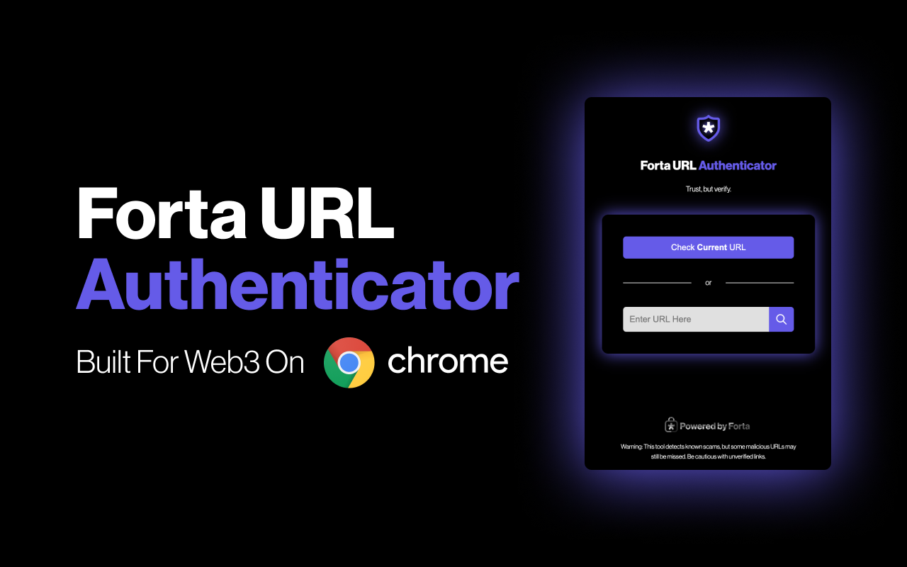
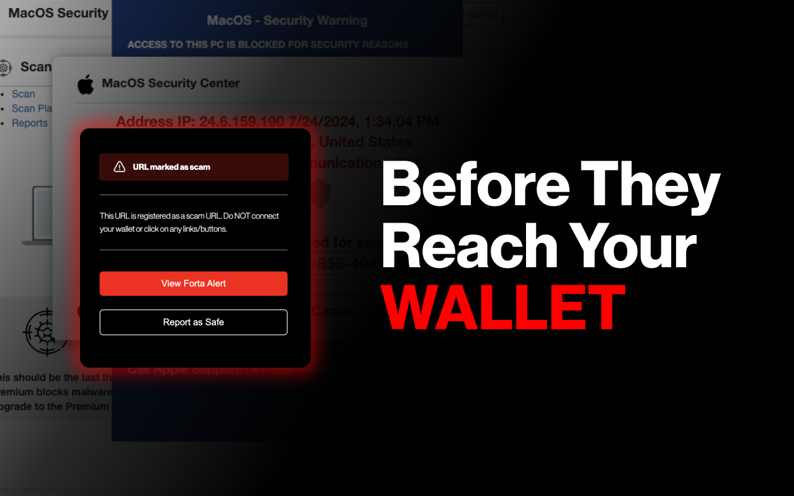
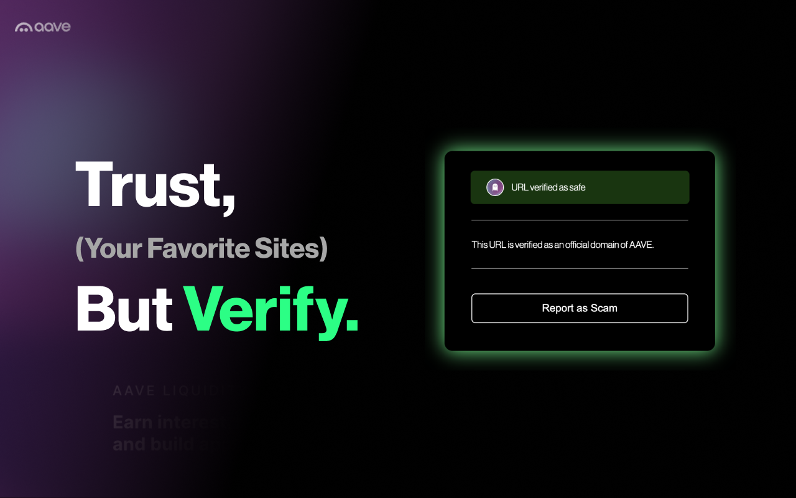

# Forta URL Authenticator 

## Overview

The **Forta URL Authenticator** is a Forta-powered Chrome extension designed to help you assess the safety of websites you visit. It provides an easy-to-use interface to check URLs for malicious reports and allows users to contribute by reporting safe or malicious sites. No cost, no login required. Trust, but verify.

<iframe width="560" height="315" src="https://www.youtube.com/embed/fhJbtl_2rTQ?si=XSqo4MGe0Dz5FLxN&amp;controls=0" title="YouTube video player" frameborder="0" allow="accelerometer; autoplay; clipboard-write; encrypted-media; gyroscope; picture-in-picture; web-share" referrerpolicy="strict-origin-when-cross-origin" allowfullscreen></iframe>

 

## Installation and Setup

1. **Install the Extension**
   - Download and install the Forta URL Extension from the [Chrome Web Store]((https://forta.org/authenticator).).

2. **Pin the Extension**
   - After installation, pin the extension to your browser's toolbar for easy access. Click the puzzle icon next to your Chrome profile picture, then click the pin icon next to "Forta URL Authenticator."

## How to Use

### Checking a URL

1. **Automatic Check**
   - Navigate to the page you want to scan.
   - Click the Forta URL Extension icon in your browser.
   - Click the **Check Current URL** button.
    

2. **Manual URL Entry**
   - Click the Forta URL Extension icon.
   - Enter the URL you want to check in the provided input field.
   - Click the **Check URL** button. 

### Understanding the Results

- **No Reports Found**: If the extension shows that no reports are found for the URL, proceed with caution if there is onchain functionality.

- **Malicious Reports**: If there are reports of the site being malicious, the extension will turn **red**. It is strongly recommended to avoid such sites. 

- **Safe Reports**: If the site is marked as safe in Forta's whitelist, the extension will turn **green**. 

### Reporting URLs

Reporting URLs is crucial for maintaining a secure environment. Submitting safe URLs helps expand the trusted whitelist, while flagging new scam URLs ensures the safety of other extension users. Your contributions are vital to keeping the web3 space safe.

1. **Report a Safe URL**
   - If you believe a site is safe, click the Forta URL Extension icon.
   - Enter the URL if not already filled.
   - Click the **Report Safe URL** button.

2. **Report a Malicious URL**
   - If you encounter a site that you believe is malicious, click the Forta URL Extension icon.
   - Enter the URL if not already filled.
   - Click the **Report Malicious URL** button.

### Disclaimer

The Forta URL Authenticator detects known scams, but may not catch all malicious URLs. Be cautious with unverified links. Forta monitors newly created scam URLs, compromised frontends of established projects will NOT be marked as scam URLs. See the [terms of service](https://forta.org/blog/forta-url-authenticator-tos/) for more information.
