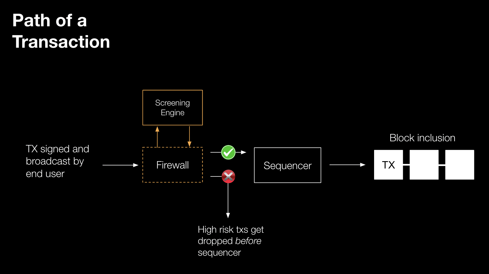

# What is Forta Firewall?

Forta Firewall screens transaction flows in real time and blocks malicious or non-compliant activity before execution. It enables programmable, pre-inclusion checks on every transaction, stopping threats before they reach the chain.

It acts as a transaction screening middleware integrated directly into the transaction flow. This allows protocols, rollups, and applications to define custom security, compliance, or operational rules, and enforce them automatically at the transaction level.

To power these decisions, Forta Firewall uses a combination of real-time transaction simulations and AI-based threat detection models trained on millions of historical attacks and continuously updated as new threats emerge

Forta Firewall is modular and extensible. It supports a variety of use cases, including:

**Threat prevention**: Detect and block smart contract exploits, scam contract deployments, rug pulls, and other malicious behaviors.

**Compliance screening**: Flag or block interactions with sanctioned addresses, high-risk wallets, or transactions that violate custom compliance policies.

**Real-time monitoring**: Continuously observes transaction behavior and protocol activity to surface anomalies such as unexpected governance proposals, suspicious multisig changes, price depegs, or stale oracle feeds.

**Permissioned environments**: custom whitelist to create walled-garden chains for particular purposes, such as KYC.

## Pre-sequencer screening for Rollups

Forta Firewall integrates directly with rollup infrastructure to block malicious and non-compliant transactions before they reach the sequencer.

Forta Firewall integrates with rollup infrastructure to screen transactions before they reach the sequencer. High-risk or non-compliant activity is automatically flagged and can be blocked in real time preventing execution of malicious or unwanted transactions.

This is made possible through direct integrations with popular Rollup-as-a-Service (RaaS) providers, including:

- Conduit

- Gelato

- Quicknode

- Alchemy

- Zeeve

If your rollup uses another RaaS provider or a custom implementation, you can contact the Forta Foundation for custom integrations.

## Censorship-Resistance

For censorship-resistance, transactions flagged as high risk are not permanently blocked, but delayed, with details revealed only to the Firewall user and giving them time to respond.

[Next :octicons-arrow-right-24:](forta-firewall-why-transaction-screening.md)