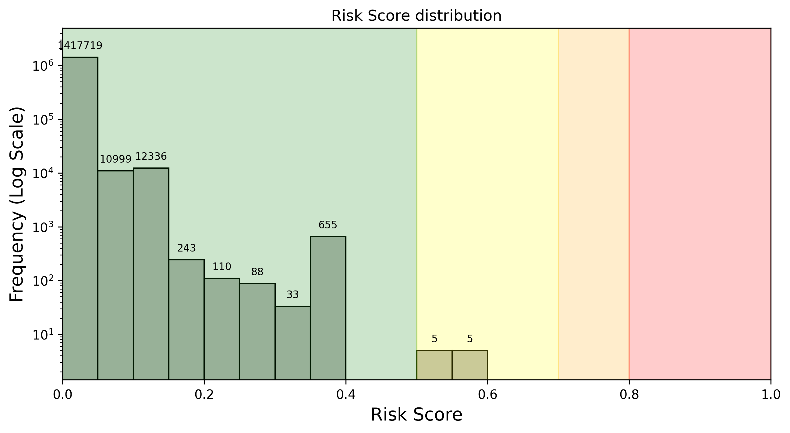

Firewall uses Al to simulate malicious transactions and block them before they reach the chain. It also prevents the deployment of scam smart contracts in real time.

### FORTRESS - AI Based Risk Scoring

Firewall uses an advanced AI model called FORTRESS to analyze and detect high-risk transactions. Each transaction simulated and screened by FORTRESS receives a risk score from 0 to 1 with a latency <60 ms. The closer the score is to 1, the more likely it is malicious. Each rollup and protocol that uses Firewall sets their desired threshold, above which transactions are blocked at the firewall.

FORTRESS has been trained on past exploits and is fine-tuned on a regular basis as Firewall screens new transactions. In terms of performance, FORTRESS can detect over 99% of exploits (recall), with a false positive rate of <0.0002% (1 in 500,000 transactions).

Here's a visual representation of the risk score distribution for a DeFi protocol's transactions over the last week:

[:octicons-arrow-left-24: Previous](forta-firewall-why-transaction-screening.md) [Next :octicons-arrow-right-24:](forta-firewall-scam-prevention.md)