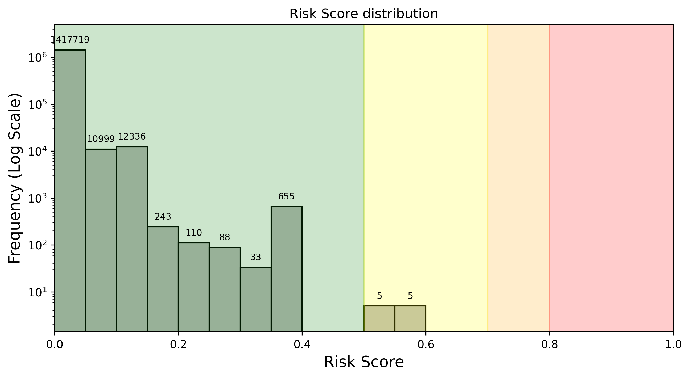

# Why Transaction Screening?

The transaction screening approach is more effective at preventing exploits than other methods, such as auto-pausing contracts because:

- **Total Visibility:** It has total visibility into pending transactions (even transactions submitted via private channels).
- **No Dependency on Speed:** It doesn’t depend on being faster than the attacker.

Regardless of how the exploit is submitted (public or private mempools), and how efficient it is (atomic vs. multiple transactions), it must pass through the Firewall before it can be executed.

Forta Firewall provides a unified layer for security enforcement, compliance checks, and real-time transaction monitoring.

### Inbox Protection for Arbitrum rollups

A capability within Forta Firewall that hardens rollup infrastructure by preventing unverified or malicious L2 transactions from bypassing security layers through the L1. Designed to enable each chain to take control of its risk management. Firstly, chains can decide which types of transactions are let through automatically, without requiring an in-depth check. Secondly, each chain can configure what checks are performed on the remaining transactions, including exploits screening, malicious contract deployments, sanctions lists or even custom blocklists.

### FORTRESS - AI Based Risk Scoring

Firewall uses an advanced AI model called FORTRESS to analyze and detect high-risk transactions. Each transaction simulated and screened by FORTRESS receives a risk score from 0 to 1 with a latency <60 ms. The closer the score is to 1, the more likely it is malicious. Each rollup and protocol that uses Firewall sets their desired threshold, above which transactions are blocked at the firewall.

FORTRESS has been trained on past exploits and is fine-tuned on a regular basis as Firewall screens new transactions. In terms of performance, FORTRESS can detect over 99% of exploits (recall), with a false positive rate of <0.0002% (1 in 500,000 transactions).

Here's a visual representation of the risk score distribution for a DeFi protocol's transactions over the last week:

[:octicons-arrow-left-24: Previous](forta-firewall-overview.md) [Next :octicons-arrow-right-24:](forta-firewall-security-screening.md)
