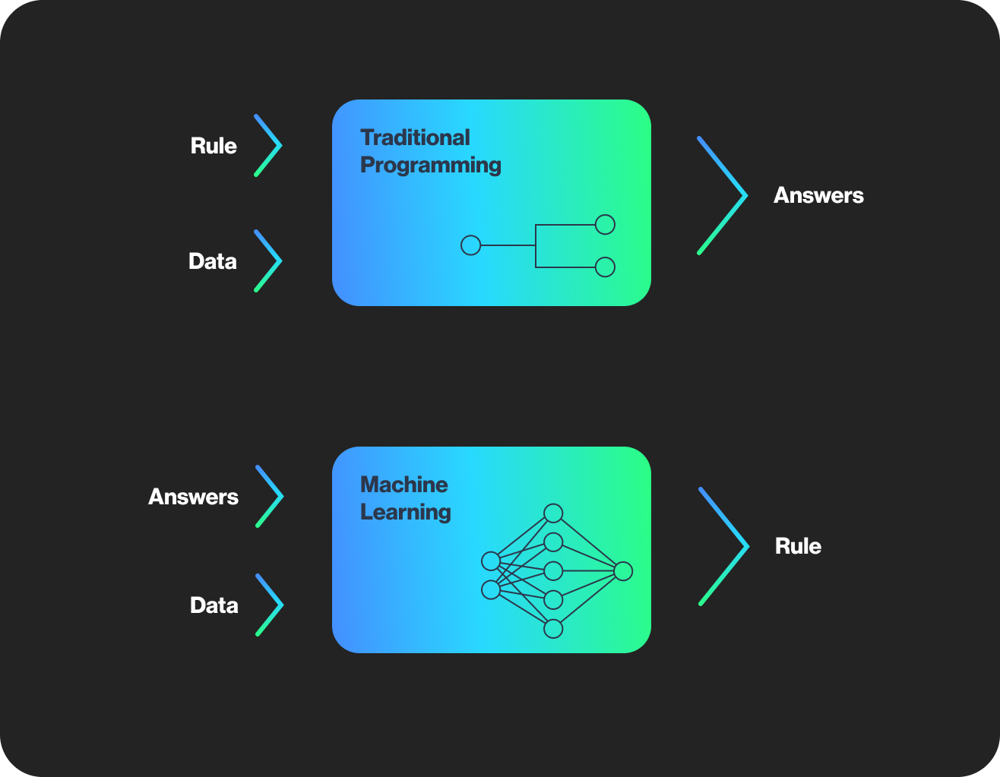

# Leveraging Machine Learning with Forta to Improve Web3 Security

*Machine learning (ML) can bring tremendous value to the security of Web3. The Forta Network stands at the forefront of supporting the data science community to innovate, research, and protect web3. With ML, Forta can detect attacks more accurately while delivering more relevant and actionable alerts. In this article, you’ll learn how ML represents an essential cornerstone to improve threat detection. This is an introduction intended for a broader audience that is new to Forta, security monitoring, and ML-based solutions.*

--- 

## What problem is Forta trying to solve?
Large exploits are rampant in the Web3 ecosystem. In April 2022, five major exploits alone resulted in a cumulative total of $200M+ in funds stolen. Security audits and bug bounty programs are important starting points for protocol security measures, but they are not enough to stop hacks and exploits (e.g. the [Qubit Finance Hack](https://rekt.news/qubit-rekt/) or [Fortress Protocol Hack](https://rekt.news/fortress-rekt/)). Once a smart contract is deployed, there are often many complicated interactions with other contracts and protocols that make it difficult to anticipate all edge cases and potential attack vectors.

## How Forta can help
Forta is a real-time detection network that helps the Web3 world prevent hacks and exploits. A community of developers and researchers can create detection bots to monitor blockchains for suspicious transactions where anyone can then be alerted by subscribing to the bots on the [Forta App](https://app.forta.network/). There are currently over 600 detection bots monitoring a wide array of threats such as re-entrancy attacks and Tornado Cash-funded transactions. These bots can send timely and relevant security alerts that can be used to neutralize threats and prevent loss of funds. Recently, Forta’s detection bots produced alerts that could have helped prevent or mitigate a number of [major exploits](https://forta.notion.site/How-Forta-alerted-on-past-hacks-d05c45f060e8404886996ca5518e6f75).

## Why is ML important?
In order to surface suspicious activities more effectively, Forta’s detection bots need to separate attacks from benign events. While this is possible with simple heuristics in certain cases, ML can utilize a broader set of signals and data than a human ever could. This allows ML to generalize better by uncovering unseen attacks and emitting alerts with high precision (i.e. low number of benign events resulting in alerts). In Web3, it is important for the most critical and relevant alerts to be delivered quickly for review and timely resolution.

Machine learning can help accomplish all the above more efficiently. Many Web2 companies like Google, Microsoft, and Amazon already rely heavily on machine learning solutions to detect anomalous events such as [system failures in networked devices](https://cloud.google.com/blog/products/ai-machine-learning/event-monitoring-with-explanations-on-the-google-cloud), [phishing attacks](https://www.microsoft.com/security/blog/2018/12/19/tackling-phishing-with-signal-sharing-and-machine-learning/), and [fraudulent online payment transactions](https://aws.amazon.com/fraud-detector/).

## What exactly is Machine Learning?
Machine learning is a field of study that combines statistics and math to help us understand and leverage data. Machine learning is already a widely adopted technology in most industries today. The average consumer has probably already seen machine learning in action in the form of e-commerce product recommendations, disease detection, and autonomous vehicles.

Compared to traditional programming, where a set of instructions is specified for a computer to execute, machine learning enables the computer to learn from past data and create its own set of instructions.

For example, ML can analyze past fraudulent credit card transactions and create its own rules to detect similar activities in the future. 

## Challenges in Machine Learning
There are however some challenges in ML that are relevant in a security context. An alert that states ‘this is an attack transaction’ may be correct, but not very helpful in the context of an incident response process. One has to be able to trust and understand why an ML model made a specific decision, so building [explainable models](https://cloud.google.com/blog/products/ai-machine-learning/why-you-need-to-explain-machine-learning-models) is critical.

Another challenge worth noting is that an algorithm’s performance will mostly depend on the quality of data it learned from. In security, labels are often sparse but techniques like weak labeling or unsupervised anomaly detection can aid in those situations.

## How can ML improve blockchain monitoring? 
ML can detect suspicious EOA or smart contract behaviors by studying past hacks and exploits’ patterns. It can also flag novel anomalous behavior by learning past “normal” blockchain account activities. ML can also help reduce noise and improve signal by clustering similar alerts and ranking them by severity/urgency.

The above are some examples of how ML can improve monitoring, but the opportunities in this space are truly limitless. The beauty of blockchain security is that there is the complete history of all transactions ever mined available publicly, whereas data may be sparse or private in other problem domains (e.g. think of a credit card company’s fraud dataset). In many other fields, larger datasets are rare and coveted pieces of information. Thankfully, this is not the case for ML on blockchain!

A blockchain can also be thought of as a graph. Transactions can be simulated. This means there is a plethora of ML opportunities from large transformer-based semi-supervised deep neural networks, to reinforcement learning agents, graph based approaches, and anomaly detection that utilizes isolation forests or time series analysis. 

## Supporting the Data Science Community
Forta is designed as a community driven project, and with the endless opportunities in the ML space, we invite the data science community to build and innovate on top of Forta. The Forta Foundation is committed to supporting this unique community through upcoming educational material, data science competitions, and grants. If you have ideas or prototypes, we would love to hear them. 

If you are new to Forta and want to put your data science skills to use, you can get a feel for blockchain data by taking a look at transactions on [Etherscan](https://etherscan.io/), build your first python detection bot using [Forta’s easy-to-use SDK](https://docs.forta.network/en/latest/quickstart/), explore the [alert data itself](https://docs.forta.network/en/latest/api/), and take a look at one of our first ML detection bots that were developed as part of the [recent contest](https://docs.forta.network/en/latest/contest6-forta/). Be sure to discuss your ideas and engage with like-minded data scientists in the [#machine-learning Discord channel](https://discord.com/channels/869983523371642921/979123596880396349).

