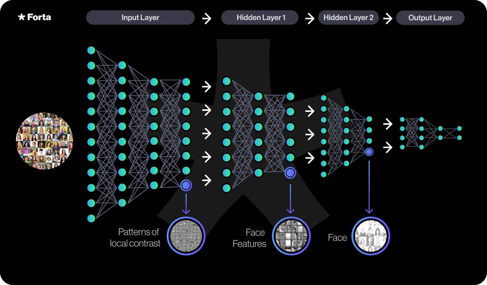
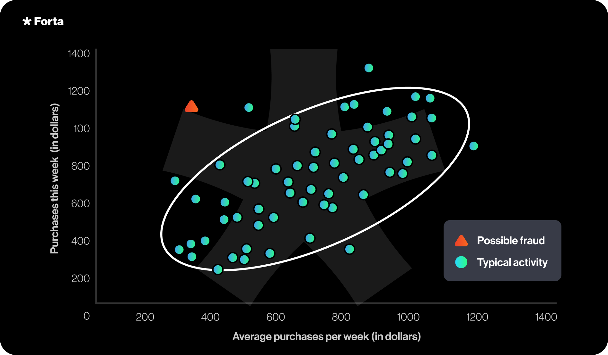
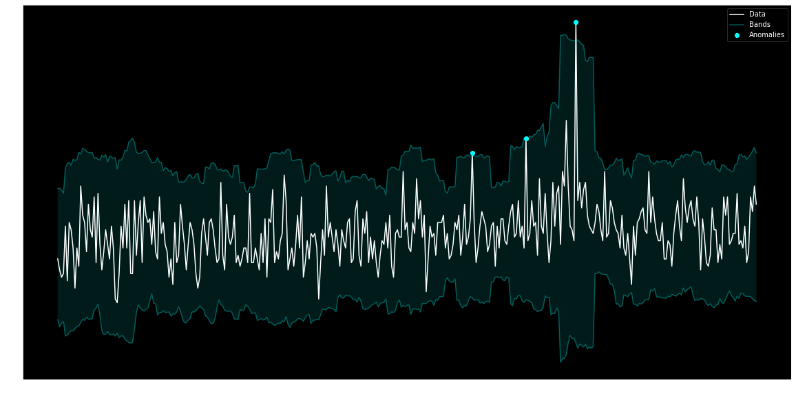

# Why Machine Learning?

Machine learning is an essential tool in a defender’s toolbox. The Forta Network supports a broad range of machine learning approaches, which are manifested in several bots deployed on the network today, which empowers the network to identify similar attacks as well as completely unknown attacks.

While Forta’s focus is threat monitoring, these capabilities can also be used more generically for any scenario where machine learning may be valuable as Forta’s network represents a distributed inference engine on on-chain activity.

Today, the following machine learning capabilities exist:

- **Deep Learning**  
  Deep Learning is a machine learning technique that can learn representations from large amounts of data without any feature engineering. It can develop knowledge about a particular domain and use it for a variety of tasks. For example, a deep learning model can go through vast amounts of blockchain transactions and develop knowledge of transaction metadata and patterns. With this knowledge, it can start detecting anomalous or malicious transactions.  

	Here’s an example of how a deep learning model can learn facial features from profile pictures and use that knowledge to distinguish or recognize individuals in the photos:
    
  Deep Learning has made tremendous strides in the last few years. In the area of natural language processing, ChatGPT has received lots of attention in the last few months. A deep learning bot utilizing a pre-trained natural language model (BERT) classifies sentiment and topics of on-chain text messages. ([bot link](https://explorer.forta.network/bot/0xbdb84cba815103a9a72e66643fb4ff84f03f7c9a4faa1c6bb03d53c7115ddc4d))

- **Supervised Classification**  
  Supervised classification is a machine learning approach to classify unknown instances based on labeled instances seen during the training phase. An example is a malicious contract classifier, which predicts whether a newly deployed contract is malicious. This approach identifies characteristics associated with malicious and benign contracts and uses those in its prediction. The advantage of supervised classification over simple heuristics is that the classifier is able to utilize many characteristics in its decision making than a bot author could capture in a manually created heuristic. ([bot link](https://explorer.forta.network/bot/0x0b241032ca430d9c02eaa6a52d217bbff046f0d1b3f3d2aa928e42a97150ec91?_gl=1*17fbeb7*_ga*MjA1ODMyMzQ2OS4xNjQ5NDIyODU3*_ga_3ERDDVRGQQ*MTY3NTcwOTU4OC40MjQuMS4xNjc1NzA5OTM0LjAuMC4w) / [blog post link](https://forta.org/blog/how-fortas-predictive-ml-models-detect-attacks-before-exploitation/))

- **Anomaly Detection**  
  Supervised classification is great when trying to identify attacks that share characteristics of previously observed attacks. However, when faced with a novel attack, supervised classification fails. This is where anomaly detection comes; the algorithm learns what is considered normal and alerts on deviation of normal.  

	However, abnormal doesn’t necessarily mean malicious, so these approaches are generally noisy (aka alert on abnormal that is not necessarily malicious). To filter out this noise, anomaly detectors are combined in such a way that they are consistent with attack behavior (e.g. anomaly detectors for each stage of the [web3 attack chain](https://forta.org/blog/web3-kill-chain/) trigger).
    

- **Time-series Anomaly Detection**  
  Anomaly detection can look at a transaction in isolation and identify whether it is anomalous. However, some anomalies are anomalies over time, such as a rise in error rates. Time-series anomaly detectors are suited for identifying these types of anomalies. Given there may be variance and seasonality contained in the data, the model needs to take those into account for an accurate model. [Prophet](https://facebook.github.io/prophet/) is a library utilized by several deployed bots to identify such anomalies. ([bot link](https://explorer.forta.network/bot/0x30547600c8b10757a559fc94a124cc27e560c8fe3af66087d8a8fadb309513ed), [bot link](https://explorer.forta.network/bot/0x0f21668ebd017888e7ee7dd46e9119bdd2bc7f48dbabc375d96c9b415267534c), [blog post link](https://forta.org/blog/time-series-analysis-with-forta/))
    

- **Clustering**  
  Lastly, clustering is a method to group similar items together. For instance, for attack detection, one may be interested in grouping related addresses together that belong to the same person. This can be accomplished, for instance, by creating a connected graph to identify connected subcomponents or by a distance metric that takes into account characteristics of the addresses. ([bot link](https://explorer.forta.network/bot/0xd3061db4662d5b3406b52b20f34234e462d2c275b99414d76dc644e2486be3e9?_gl=1*11qbofc*_ga*MjA1ODMyMzQ2OS4xNjQ5NDIyODU3*_ga_3ERDDVRGQQ*MTY3NTcwOTU4OC40MjQuMS4xNjc1NzEwNjQxLjAuMC4w))
    

Machine learning is not a silver bullet when it comes to threat detection. However, it is an important tool in the defender’s arsenal. Forta supports a broad range of machine learning approaches that identify attacks every single day to ultimately secure web3.