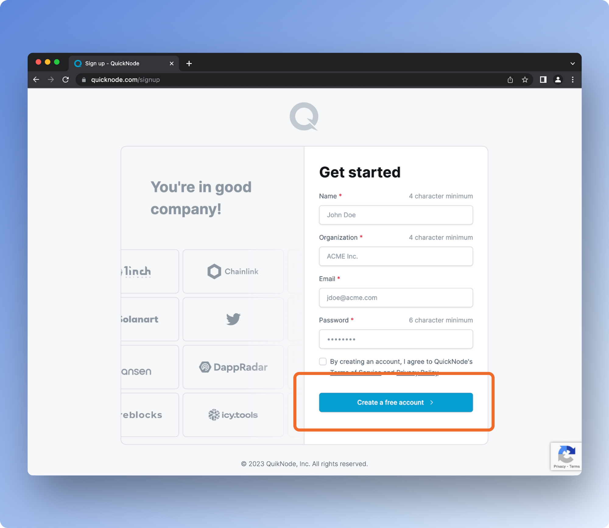
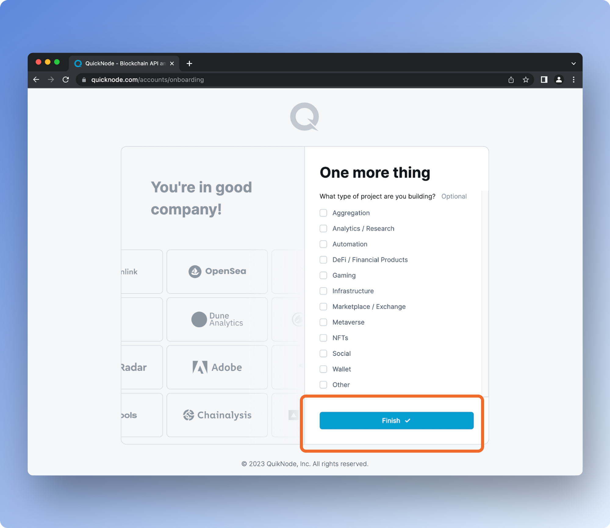
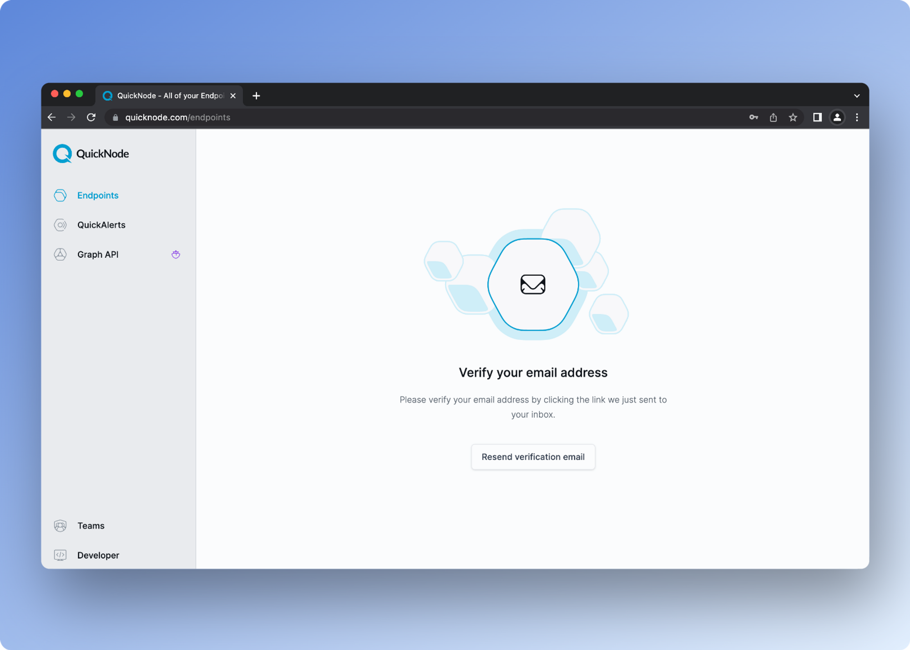
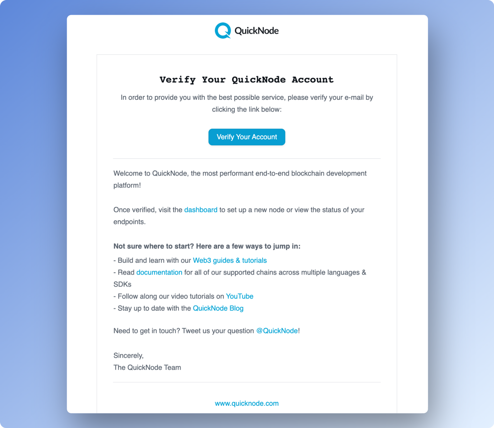
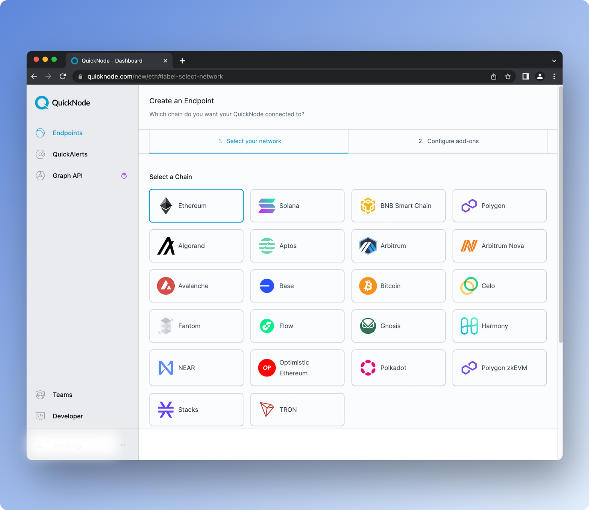
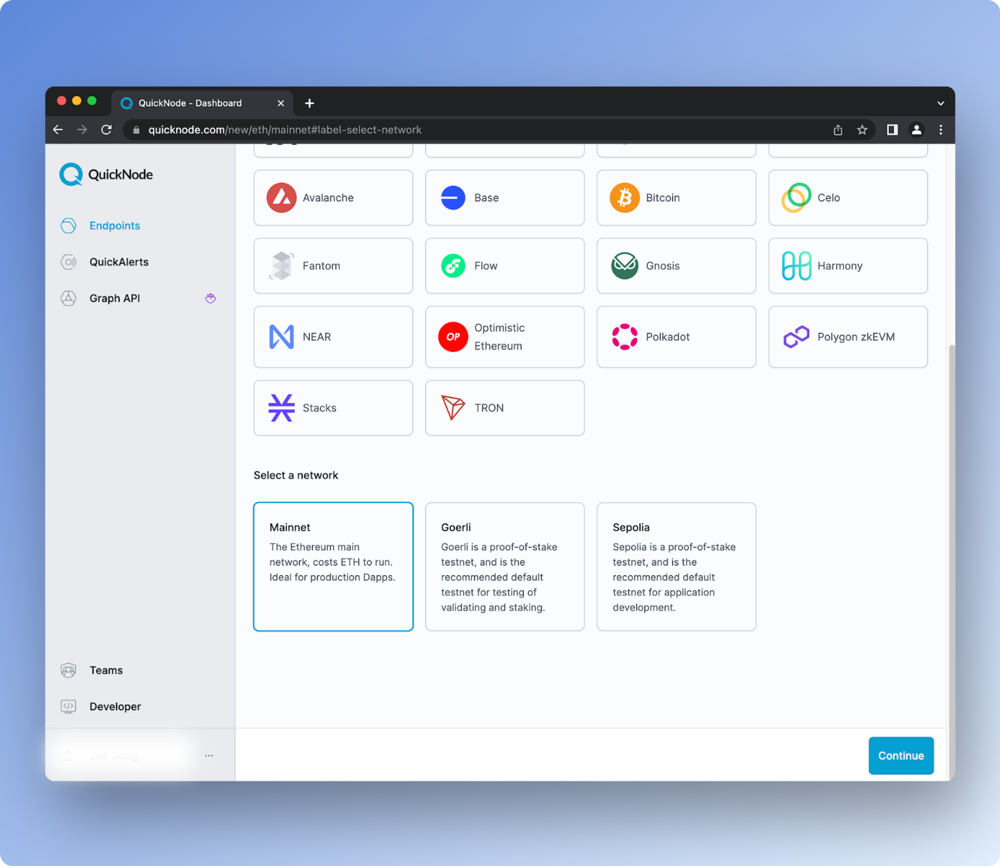
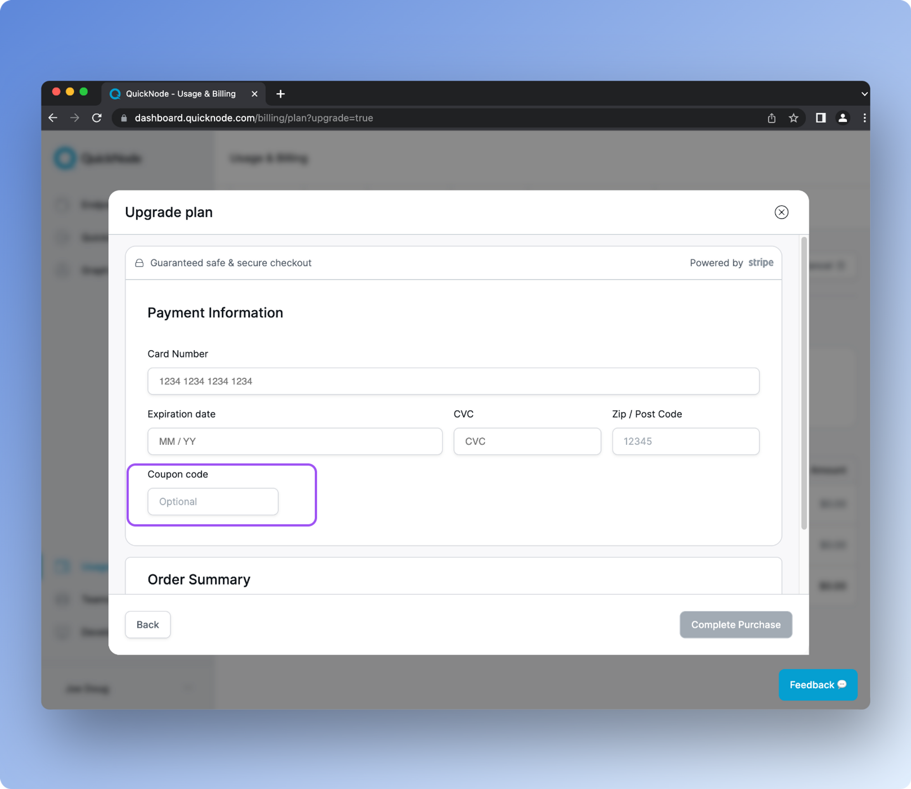

!!! info "Disclosure" 
    The following documentation was written by the team at QuickNode and does not reflect the views of the Forta Foundation.

# Scan With QuickNode

## Why Use QuickNode?

QuickNode powers blockchain-enabled internet for the modern world. As the most performant end-to-end Web3 development platform, QuickNode makes it easy to build and scale dApps with globally-balanced blockchain infrastructure, best-in-class elastic APIs, powerful analytics and tools, an abundance of valuable developer resources, and 24/7 customer support. QuickNode uses multiple client implementations and usage-specific node clusters for consistent performance at any scale — successfully handling billions of blockchain calls daily with 2.5x faster response times than competitors. 

With QuickNode, blockchain developers can instantly unlock multi-chain scaling with access to 22+ chains and 35+ networks — including all major testnets. Since 2017, QuickNode has empowered hundreds of thousands of top developers and companies to focus on innovation by accelerating dApp build times and offering enterprise-grade solutions to businesses of every size. As a result, leading Web3 companies like Nansen, Copper, Adobe, Magic Eden, and Dune Analytics trust QuickNode to power their businesses and deliver exceptional results.

## QuickNode’s Core API

QuickNode's Core API provides seamless interaction with blockchain networks for both reading and writing data — leverage QuickNode's elastic API for lightning-fast responses and frictionless Web3 development.

Quick, powerful, and reliable, our Core API is your launchpad into frictionless web3 development:

**Speed:** QuickNode's blockchain API responses are on average 2.5x faster than competitors.

**Reliability:** With an uptime service-level agreement (SLA), QuickNode ensures that your application is up and running when you need it.

**Scalability:** QuickNode offers unlimited scalability. Whether you have ten users today or billions tomorrow, it scales with your needs, irrespective of the volume.

**Real-time analytics:** Quickly fetch metrics that matter, including method calls over time, response statuses, method response time, and more.

**Security:** QuickNode offers world-class security features, including token-based authentication, referrer whitelisting, domain masking, and more to ensure your endpoints are safe and [secure](https://www.quicknode.com/core-api).

**Archive:** QuickNode's Core API allows developers to access all historical states of values in smart contracts as well as all account balances.

**Trace & Debug:** The API provides a feature to request the node to re-execute the desired transaction with varying degrees of data collection.

With QuickNode's Core API, the blockchain experience is simplified. It allows you to streamline your development process without the added cost of dealing with bug fixes, uptime, customer complaints, and more. Built for developers, by developers, QuickNode's tools are designed with user-friendliness in mind. Connect to the blockchain in one line of code, and learn the rest from our best-in-class documentation.

### **Special Offer**

Together, QuickNode and Forta are committed to protecting Web3 users and supporting the developers that are building solutions to make blockchain safer for everyone. Thanks to this new partnership, Forta scan node runners can enjoy a discount on QuickNode’s Build Plan.

Now that we know how QuickNode helps your Forta nodes be more reliable and performant, let's dive into how to create a new QuickNode account completely for free.

On top of the best-in-class infrastructure, QuickNode users will also get access to:

- Access to 22+ chains and 35+ networks
- QuickAlerts
- Graph API
- NFT Fetch API
- Token API
- One-click add-ons from the QuickNode Marketplace
- 24/7 support

**Claim this discount - “Forta20”** (don’t add the quotes into the coupon section, just Forta20).

## Getting Started with QuickNode

Let’s get started and see how easy and painless it is to create an RPC endpoint in just a few minutes. To build on any of QuickNode’s supported blockchains, you'll need an API endpoint to connect with the network. Let’s follow a few short steps to create our custom endpoint:

Go to [https://QuickNode.com/](https://QuickNode.com/) and click “Create account”


Enter your information and click the button to “Create a free account”



Next, specify which type of project you are building. Choose “Other” and enter scan node. 



Once you click “Finish,” you’ll see this screen. You’ll need to check your email inbox to complete the next step.



Check your email to verify your QuickNode account.
Click “Verify Your Account”



Clicking verify in the above email will take you back to the developer portal. Next, you’ll click “Create an endpoint.”


Select the chain you’d like to build on.



And select the network



Next, you’ll be prompted to select add-ons from the QuickNode Marketplace to add. There are many free add-ons available to supercharge your dApp — along with several paid add-ons from industry leaders.

This step is optional. You can continue without selecting any add-ons.


Next, select a plan. Choose the “Build” plan to apply your discount.


Finalize your Build plan and enter your coupon code “**Forta20**” here before completing your purchase (don’t add the quotes into the coupon section, just Forta20).



Select your endpoint.


From here, you’ll need to grab the RPC URL required to set up your Forta node.

You can copy the HTTP Provider or WSS Provider URL to use in your web3 application. On your endpoint's page, you can view **Metrics**, manage **Add-ons**, and control **Security** features such as token authentication, JSON Web Tokens (JWT), referrer whitelisting, and more.


Now that you have your HTTPS RPC URL, we’ll need to connect QuickNode to the Forta scan node running on your terminal.

## Configure your QuickNode Chain APIs

If you haven’t already installed Forta on your terminal, make sure to go through the [quickstart guide](https://docs.forta.network/en/latest/scanner-quickstart/) for kickstarting your Forta scan node.

Once your Forta directory has been initialized, you’ll find a file named  `config.yml`. We’ll need to configure that file so that our scan node knows how to pull data from the blockchain.

Forta detection bots are able to call JSON-RPC APIs using the RPC endpoints and the chain ID configured in the `config.yml` file, to do so, we’ll need to initialize the `scan.jsonRpc.url` property in the config.yml file, with the QuickNode HTTP RPC URL from your account.

Open the config.yml file in your Forta directory, and copy your QuickNode RPC URL in the jsonRpc property:

```
chainId: 1

scan:
  jsonRpc:
    url: https://{Your QuickNode RPC URL}
```         

That’s it! Your Forta node will now scan blockchain transactions at lightning speed using QuickNode’s Core API.

Please note that we’ve set the chainId property to one in the above code. This is because we provided guidance to create an Ethereum application, and the Ethereum Mainnet chain ID is one.

If you want to scan other chains like Polygon, Arbitrum, or Optimism, please refer to the following section!