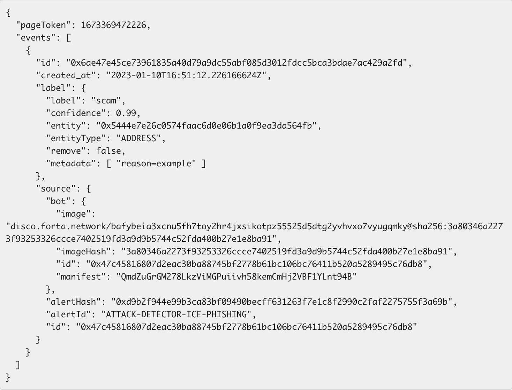

# Scam Detector Docs

| Bot Name | Bot ID | Bot Stats | Bot Source Code  | Supported Chains | 
|----------|--------|-----------|------------------|------------------|
| Scam Detector | 0x1d646c4045189991fdfd24a66b192a294158b839a6ec121d740474bdacb3ab23 | [Stats](https://explorer.forta.network/bot/0x1d646c4045189991fdfd24a66b192a294158b839a6ec121d740474bdacb3ab23) | [Github Repo](https://github.com/forta-network/starter-kits/tree/main/scam-combiner-py) | All | 

## Overview
The Scam Detector is an ideal source of threat intel for Web 3 wallets and dashboard tools, as well as for security and compliance solutions serving a retail or institutional audience. Use the Scam Detector to build or supplement a black list, or as a transaction analysis tool by querying the Scam Detector at the point of approval or transaction to determine whether they are malicious. 

The Scam Detector provides threat intelligence about malicious smart contracts and EOAs engaging in scams and other end user attacks. It relies on a *bundle* of underlying Forta bots, each monitoring for a specific threat type (ex: Ice Phishing). The Scam Detector and its underlying bots are collectively maintained by the Forta community, including the Forta Foundation, Nethermind, and dozens of individual security researchers and developers.

## How it works
Forta bots are monitoring on-chain activity 24/7/365. Some bots leverage a heuristic-based approach, others leverage machine learning to identify malicious activity. When bots identify an attack or scam on-chain, they create two types of threat intelligence:

- **Labels.** A persistent tag placed on an entity (smart contract or EOA) responsible for a scam or attack. Today, the Scam Detector assigns two labels: “scammer-eoa” and “scammer-contract”. Labels also feature the threat type via the alert ID field (ex: ICE PHISHING), a link to the description of the alert ID, and a confidence score from 0 to 1. 

- **Alerts.** Findings emitted in real-time by a bot about something that happened on-chain. Example, if a flashloan occurred in the last block, a bot monitoring for flashloan transactions would emit an alert on that flashloan when the next block is confirmed. Alerts from the Scam Detector contain metadata about the transaction(s) that triggered the alert, the entities involved and the threat type.      

The Scam Detector currently monitors on-chain activity for the following threat types:

- Ice phishing
- Social engineering native ice phishing
- Fraudulent Seaport/Blur orders
- Address poisoning
- NFT Wash trading

New threat types are regularly added to the Scam Detector by the Forta community. 

Here’s a [glossary](https://forta.org/attacks/) defining threat types in more detail. 

## Using the Scam Detector  
Scam Detector *labels* and *alerts* are each available via their respective APIs. For accessing threat intel from the Scam Detector we recommend using the Labels API. **Currently, no API key is required.** 

### *Labels*
There are two approaches to querying for labels:

1. (*Recommended*) If you want the latest *state* of the labels for an entity (i.e. if you want to know whether an address is currently labeled “scam”), you can use the endpoint at [https://api.forta.network/labels/state](https://api.forta.network/labels/state).

2. You can also query for label *events*. Label events tell you when certain labels were added/removed, ordered by timestamp. You can access the REST API at [https://api.forta.network/labels/events](https://api.forta.network/labels/events). Here is an example response: 

More details on querying the Labels API can be found [here](https://docs.forta.network/en/latest/labels/#querying-labels). 

### *Alerts*

Whereas labels tell you what the Forta Network knows about a particular entity, alerts tell you something happened (i.e. an attack). There are two ways to access alerts: the API (pull) and subscription (push). You can access the Alerts API [here](https://docs.forta.network/en/latest/api/). Alternatively, If you want alerts *pushed* to you in real-time, you can also [subscribe](https://explorer.forta.network/bot/0x1d646c4045189991fdfd24a66b192a294158b839a6ec121d740474bdacb3ab23) to the Scam Detector directly and select your desired communication channel (webhook, email, Discord, Telegram, Slack).    

## What chains are supported?

- Ethereum
- BNB Chain
- Polygon
- Avalanche
- Arbitrum
- Optimism 
- Fantom 

The Forta community evaluates new chains on an ongoing basis.

## False Positives
While the Scam Detector maintains high precision, it’s possible that it identifies a false positive. To address this risk, the Forta community manually verifies certain Scam Detector alerts within one business day. If a false positive is identified during the manual verification process, an FP alert will be emitted by the Scam Detector and the label will be removed. If you’re accessing the Labels API via the state endpoint, all labels are up to date and take into account the latest FP information. 

## Confidence Scores
The confidence score associated with a label is hard coded and based on the precision analysis performed by the Forta community. The score is updated on a monthly basis, and reflects the accuracy of the Scam Detector for a particular alert ID/threat type *before* manual verification. 

## Bots included in the Scam Feed
Here’s a list of the underlying bots supporting the Scam Detector:

| BotID | Name | AlertId | Stage |
|-------|------|---------|-------|
| 0xd9584a587a469f3cdd8a03ffccb14114bc78485657e28739b8036aee7782df5c | nft-transfer-alert | SEAPORT-PHISHING-TRANSFER | Exploitation |
| 0x8badbf2ad65abc3df5b1d9cc388e419d9255ef999fb69aac6bf395646cf01c14 | ice phishing | ICE-PHISHING-HIGH-NUM-APPROVALS | Preparation |
| 0x8badbf2ad65abc3df5b1d9cc388e419d9255ef999fb69aac6bf395646cf01c14 | ice phishing | ICE-PHISHING-PREV-APPROVED-TRANSFERED | Exploitation |
| 0xa91a31df513afff32b9d85a2c2b7e786fdd681b3cdd8d93d6074943ba31ae400 | tornado cash withdrawl | FUNDING-TORNADO-CASH | Funding |
| 0x617c356a4ad4b755035ef8024a87d36d895ee3cb0864e7ce9b3cf694dd80c82a | tornado cash funding | TORNADO-CASH-FUNDED-ACCOUNT-INTERACTION | Funding |
| 0x4adff9a0ed29396d51ef3b16297070347aab25575f04a4e2bd62ec43ca4508d2 | money laundering | POSSIBLE-MONEY-LAUNDERING-TORNADO-CASH | MoneyLaundering |
| 0x11b3d9ffb13a72b776e1aed26616714d879c481d7a463020506d1fb5f33ec1d4 | txt messaging bot | forta-text-messages-possible-hack | Exploitation |
| 0x4c7e56a9a753e29ca92bd57dd593bdab0c03e762bdd04e2bc578cb82b842c1f3 | unverified contract creation | UNVERIFIED-CODE-CONTRACT-CREATION | Preparation |
| 0xbc06a40c341aa1acc139c900fd1b7e3999d71b80c13a9dd50a369d8f923757f5 | flashbot attack bot | FLASHBOT-TRANSACTION | Exploitation |
| 0x11b3d9ffb13a72b776e1aed26616714d879c481d7a463020506d1fb5f33ec1d4 | text messages agent | forta-text-messages-possible-hack (high severity only) | MoneyLaundering |
| 0xd935a697faab13282b3778b2cb8dd0aa4a0dde07877f9425f3bf25ac7b90b895 | Malicious Address Bot | AE-MALICIOUS-ADDR | Exploitation |
| 0x46ce98e921e2766a922840a56e89f24409001052c284e0bd6cbaa4fecd95e9b6 | Sleep Minting | SLEEPMINT-2, SLEEPMINT-1 | Preparation |
| 0x127e62dffbe1a9fa47448c29c3ef4e34f515745cb5df4d9324c2a0adae59eeef | Aztec funded contract interaction | AK-AZTEC-PROTOCOL-FUNDED-ACCOUNT-INTERACTION-0 | Exploitation |
| 0xf496e3f522ec18ed9be97b815d94ef6a92215fc8e9a1a16338aee9603a5035fb | CEX Funding bot | CEX-FUNDING-1 | Funding |
| 0x9fbf4db19f23627633d86bb1936dabad0b27ebe09b7a38028a126392156f7f32 | Aztec Funding bot | AK-AZTEC-PROTOCOL-FUNDING | Funding |
| 0x2df302b07030b5ff8a17c91f36b08f9e2b1e54853094e2513f7cda734cf68a46 | Malicious Account Funding Bot | MALICIOUS-ACCOUNT-FUNDING | Funding |
| 0xdba64bc69511d102162914ef52441275e651f817e297276966be16aeffe013b0 | Umbra bot | UMBRA-RECEIVE | Funding |
| 0x9324d7865e1bcb933c19825be8482e995af75c9aeab7547631db4d2cd3522e0e | ChangeNow Funding | FUNDING-CHANGENOW-NEW-ACCOUNT | Funding |
| 0x887678a85e645ad060b2f096812f7c71e3d20ed6ecf5f3acde6e71baa4cf86ad | Malicious Token ML | SUSPICIOUS-TOKEN-CONTRACT-CREATION | Preparation |
| 0x067e4c4f771f288c686efa574b685b98a92918f038a478b82c9ac5b5b6472732 | Wash trading bot | NFT-WASH-TRADE | Preparation | 