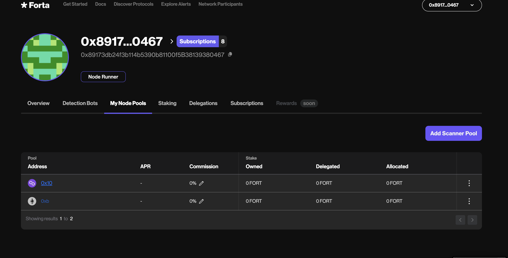

# Manage Your Scanner Pools

## Introduction

A scanner pool contains a group of nodes that scan a specific chain. Each pools belongs to a specific owner and is minted as an NFT (ERC-721) upon registration. These pools require the operators to deposit a total amount of stake which covers the minimum-per-scan-node amount for each node.

When registering any node to a pool, make sure to stake this minimum amount of **2500 FORT** on the pool first.

In addition, the scanner pools allow other FORT token holders (delegators) to stake on your pool and earn rewards. As the pool operator, you can decide

- how much of the delegator or operator stake to be allocated,
- how much commission you want from delegators' rewards.

## Creating a new scanner pool
- In the Forta App navigate to “My Node Pools”

- Click “Add Scanner Pool”

- Select a chain for your node pool to monitor and register your node pool

- Accept the transaction for creating your node pool and wait for it to be confirmed

## Depositing stake

### Depositing on your own pool
- In the Forta App navigate to “My Node Pools”

- Click on node pool you would like to add stake

- Click “Add Stake”

- In order to stake, there are two transactions that must be excecuted:
    - Approve the amount of FORT to stake
    - Stake the approved FORT

- Enter the amount of FORT you want to approve for staking and wait for the transaction to confirm

- Enter the amount of *approved* FORT you want to stake and wait for the transaction to confirm

### Delegating to a pool

- Find a node pool (that you do not own) on the Network Participants page that has a node and enough stake to earn rewards

- Navigate to the node pool page by clicking on the address

- Click on the “Delegate” button. There are 2 transactions required for delegation
    - Approve the amount of FORT to delegate
    - Delegate the approved FORT

- Enter the amount of FORT you want to approve for delegation. Click “Approve tokens” and approve the transaction. Wait for the transaction to confirm.

- Enter the amount of approved FORT want to delegate and click “Delegate” and approve the transaction. Wait for the transaction to confirm

- Navigate to “My Stakes” or  “Overview” on your profile and you can see your staked FORT

## Creating new nodes

Each node needs to be registered to a specific pool in order to be operational. While one can register many scan nodes on a pool, the pool needs to be populated with more stake first in order to avoid registration issues. This is for preventing pool shutdown conditions that occur when the average per-scanner stake is below minimum.

- In the Forta App navigate to “My Node Pools”

- Click on the node pool you would like to add a node

- Make sure you have at least 2,500 FORT staked for the new node. Click “Add Scan Node”. Use the Forta node CLI to generate the scanner authorization token (described [here](scanner-quickstart#register-scan-node)) needed to claim a node into a pool.

## Disabling existing nodes

If a node is no longer used, it should be disabled to free up allocated stake for newer nodes.

- Navigate to the node pool that has the node you want to disable

- Select the disable action on the node you want to disable

## Adjusting stake allocation

While it's always possible to add more stake to a pool, it is allocated proportional to the amount of scan nodes in the pool. Total allocated stake can only be `node_count × max_stake_per_scan_node`.

For example, if there are two scan nodes in a pool, a total of 25k FORT deposited and only 5k FORT worth of stake is allowed per scan node, then the pool can allocate a maximum of `5k × 2 = 10k` FORT in total. This is the amount that is effective in calculating the rewards and the rest of `25k - 10k = 15k` remains unallocated until more scan nodes are registered to the pool.

It is up to the pool owner to allocate more from own stake or more from the delegators so the share of the rewards can be adjusted accordingly.

### Adjusting own stake

**TODO:** Add screenshots and describe the steps.

### Adjusting delegator stake

**TODO:** Add screenshots and describe the steps.

## Changing the commission

The pool owners can adjust the ratio of the shares they would like to keep for themselves or the delegators, by changing the allocated amounts as described in the previous sections. It can be the case that it's more desirable for the operator to not stake more on the pool but let the delegators fill up the available allocation capacity.

In this case, the commission allows the operators to earn a portion of the delegators' rewards.

**TODO:** Add screenshots and describe the steps.

## Claiming rewards

!!! warning "Phase II feature"
    This is a feature that will be activated and useful in the second phase of the transition to delegated staking. At the time of reading these docs, the feature may not be available on Forta App just yet. The rewards accrued in FORT will be forwarded to pool owner wallets until this feature is available.

After the rewards are calculated at the end of each epoch, they are transferred to the rewards distributor contract. This contract allows the pool owner and the delegators to claim their rewards.
