# Manage Scanner Pools and Stake

## Introduction

A scanner pool contains a group of nodes that scan a specific chain. Each pool belongs to a specific owner and is minted as an NFT (ERC-721) upon registration. These pools require the operators to deposit a total amount of stake which covers the minimum-per-scan-node amount (**2500 FORT**) for each node.

When registering an extra node to a pool, make sure to top up your pool with this minimum amount first.

The pool owners which allocate at least the minimum amount required per scanner for their monitored chain, may allow delegations to their pools (up to the max stake allowed: 15,000 FORT per node). Operators can decide

- how much of the delegator or operator stake should be allocated,
- what percentage to keep as commission from delegators' rewards.

## Creating a new scanner pool
- In the Forta App navigate to “My Node Pools”

- Click “Add Scanner Pool”
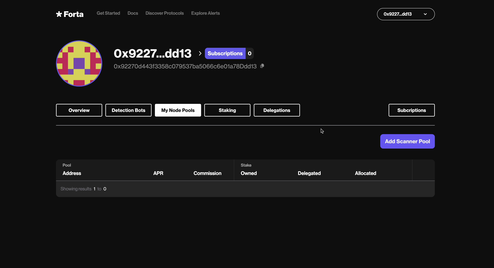

- Select a chain for your node pool to monitor and register your node pool

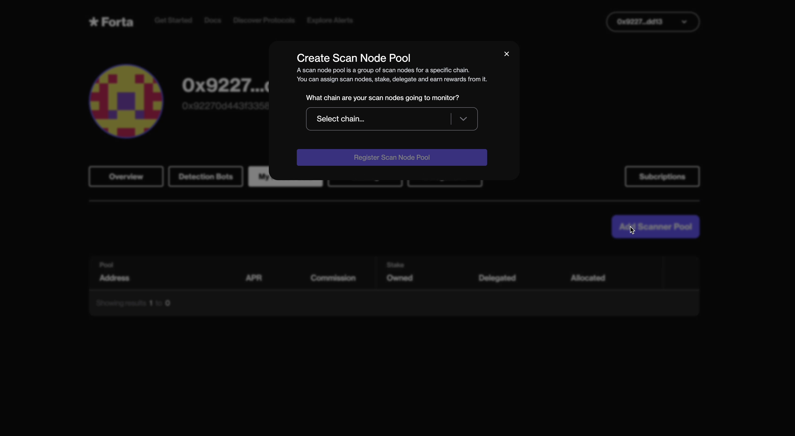

- Accept the transaction for creating your node pool and wait for it to be confirmed

## Depositing stake

In order to make scan nodes operational and generate rewards, a node pool must have stake.

- Both the pool owner and delegators can stake on a pool.
- There is no limit on how much FORT can be staked on a pool.
- There _is_ a limit on how much FORT can be allocated: More nodes in a pool means a higher limit.
- The pool owner decides how much of the owner and delegated stake should be allocated.

!!! danger "Density affects the rewards"
    When staking on a pool, please prefer the ones that have allocation capacity or have low amount of unallocated stake. While a lot of depositors can share the rewards of a pool proportionally to their active stake amount on the pool, the rewards are generated based only on the amount of allocated stake.

Please also see the [Adjusting stake allocation](#adjusting-stake-allocation) section before depositing any stake.

### Depositing on your own pool
- In the Forta App navigate to “My Node Pools”

- Click on node pool you would like to add stake

- Click “Add Stake”

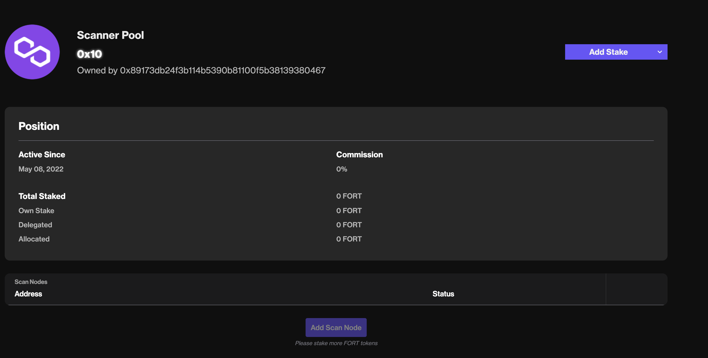

- In order to stake, there are two transactions that must be executed:
    - Approve the amount of FORT to stake
    - Stake the approved FORT

- Enter the amount of FORT you want to approve for staking and wait for the transaction to confirm

- Enter the amount of *approved* FORT you want to stake and wait for the transaction to confirm

### Delegating to a pool

- Find a node pool (that you do not own) on the Network Participants page that has a node and enough stake to earn rewards

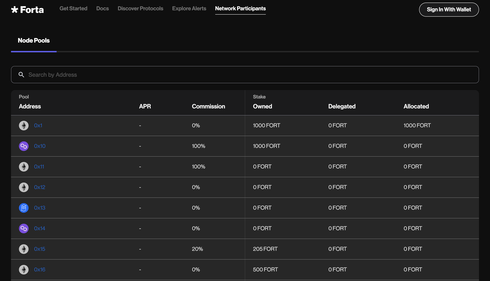

- Navigate to the node pool page by clicking on the address

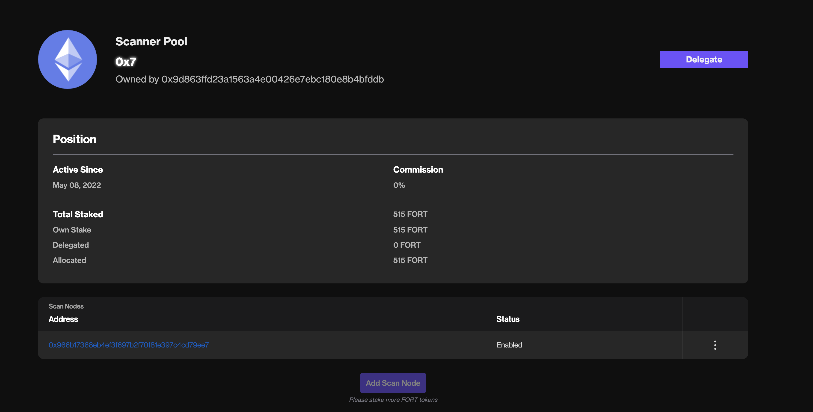

- Click on the “Delegate” button. There are 2 transactions required for delegation
    - Approve the amount of FORT to delegate
    - Delegate the approved FORT

- Enter the amount of FORT you want to approve for delegation. Click “Approve tokens” and approve the transaction. Wait for the transaction to confirm.

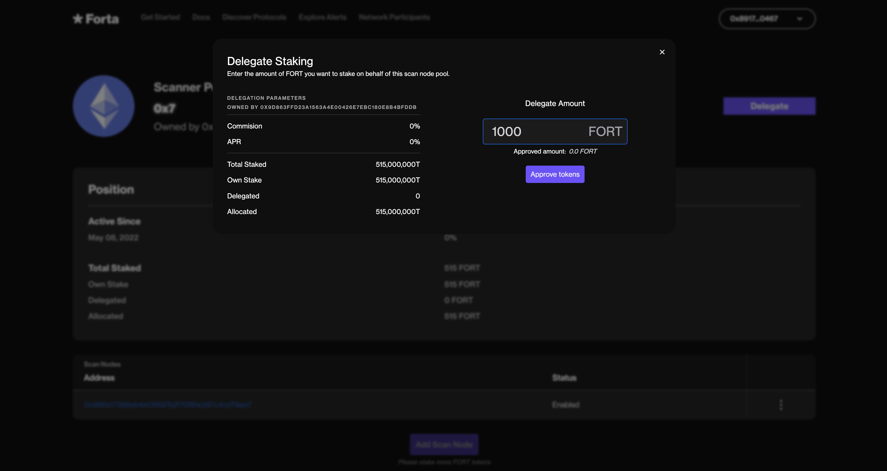

- Enter the amount of approved FORT you want to delegate and click “Delegate” and approve the transaction. Wait for the transaction to confirm

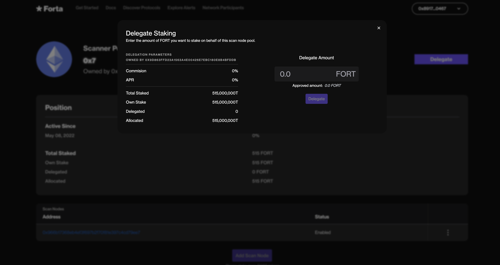

- Navigate to “My Stakes” or “Overview” on your profile and you can see your staked FORT

### Withdrawal

You can withdraw your stakes by navigating to the “My Stakes” page from the top right menu.

!!! warning "Stake lockdown"
    Once the stake withdrawal is initiated, it becomes inactive immediately but cannot be withdrawn for 10 days. Please keep in mind that this delay is subject to change.

## Creating new nodes

Each node needs to be registered to a specific pool in order to be operational. While one can register many scan nodes on a pool, the pool needs to be populated with more stake first in order to avoid registration issues. This is for preventing pool shutdown conditions that occur when the average per-scanner stake is below minimum.

- In the Forta App navigate to “My Node Pools”

- Click on the node pool you would like to add a node

- Make sure you have at least 2,500 FORT staked for the new node. Click “Add Scan Node”. Use the Forta node CLI to generate the scanner authorization token (described [here](scan-node/register.md#register)) needed to claim a node into a pool.

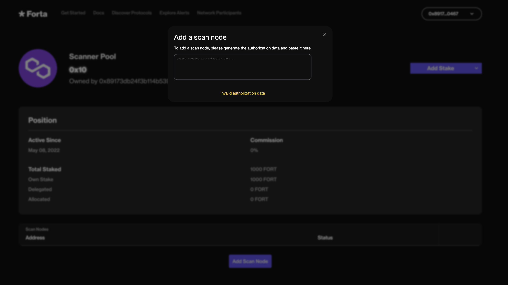

## Disabling existing nodes

If a node is no longer used, it should be disabled to free up allocated stake for newer nodes.

- Navigate to the node pool that has the node you want to disable

- Select the disable action on the node you want to disable

## Adjusting stake allocation

The pool owner has the ability to decide how much of the tokens staked in the pool (owner stake and delegated stake) are allocated. This allocation is divided by the number of scan nodes at the time of:

- checking if the pool satisfies the minimum stake allocation per node,
- calculating rewards using the [rewards formulas](delegated-staking-rewards.md).

While it's always possible to add more stake to a pool, it is allocated proportionally to the amount of scan nodes in the pool. The maximum amount of total allocated stake can only be `node_count × max_stake_per_scan_node`.

- The owner of the pool needs to allocate at least 2,500 FORT of his own stake for each node in a pool, for the pool to be active.
- The total allocation capacity is 15,000 FORT for each node in a pool.

When you deposit more stake on your pool as the owner of the pool and then register a node to it, your stake is allocated automatically. It is up to the pool owner to allocate more from owner stake or more from the delegators so the partitioning of pool rewards (owner vs. delegator) can be adjusted accordingly.

!!! note "Subject to change"
    These limits are subject to change over time.

**For example**, let's assume that at a given time frame:

- The minimum stake allocation required per node is 2500 FORT.
- The maximum stake allocation allowed per node is 5000 FORT.

In this **example** case, then this is how allocation and node registration plays together:

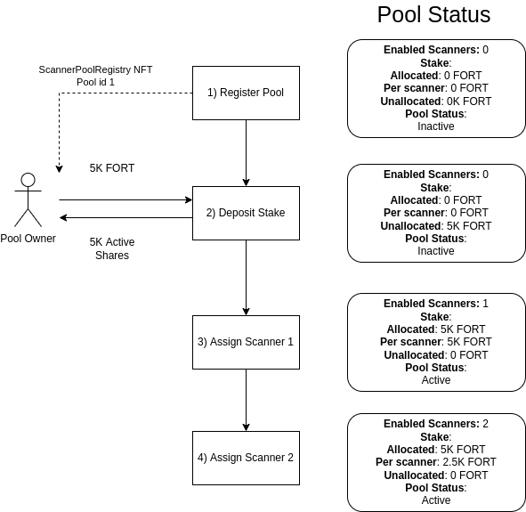

!!! danger "Risk of shutting down the pool"
    After unallocating owner stake as the operator, if allocated owner stake does not satisfy `node_count × min_stake_per_scan_node`, the pool faces the risk of shutting down and will generate no rewards! Please take into account the warnings and your calculations before proceeding.

    E.g. for a pool with two nodes, 4k FORT stake on the pool means that both of the nodes in the pool are non-operational until it can be topped up to 5k (`2500 × 2`) by the pool owner and allocation of owner stake is adjusted accordingly.

- In the Forta App navigate to “My Node Pools”

- Click on the node pool you would like to adjust the stake allocation

- Click on "Allocate Stake"

- From here you can either allocate or unallocate stake. To adjust owner stake make sure the subject is *Owner*

- To adjust the stake of delegators select the *Delegators* subject

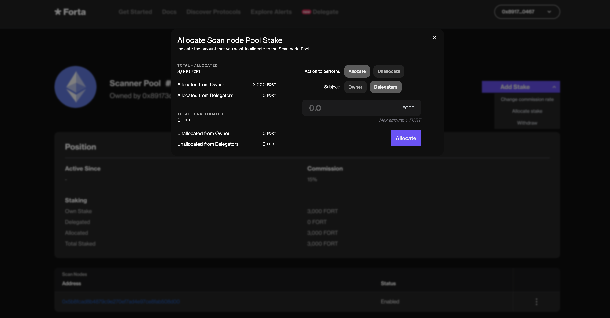

## Changing the commission

In addition to the allocation adjustment, operators can decide how much of the delegators' rewards they would like to keep as commission.

By default, all pools start with 100% commission, meaning that all delegator rewards will be received by the pool owners. This should be adjusted to a desired number by the pool owner if delegators are expected.

!!! warning "Commission lockdown"
    Once the commission is modified, it becomes effective at the start of the next two epochs and cannot be changed for two epochs (excluding the current one). Please keep in mind that this delay is subject to change.

For example, let's assume:

- Delegator 1 deposits 12000 FORT.
- Delegator 2 deposits 6000 FORT.
- Pool commission is 10% (1000 BPS).
- The pool delegators are rewarded 2000 FORT in total.

In this case, `2000 × 0.1 = 200` FORT is credited to the pool owner as commission. From the remaining 1800 FORT,
 each of the delegators earn proportionally to their deposited stake:

- Delegator 1: 12000 => 1200
- Delegator 2: 6000  => 600 

- Click on the node pool you would like to adjust the stake allocation (you must be the owner)

- Click on "Change commission rate"

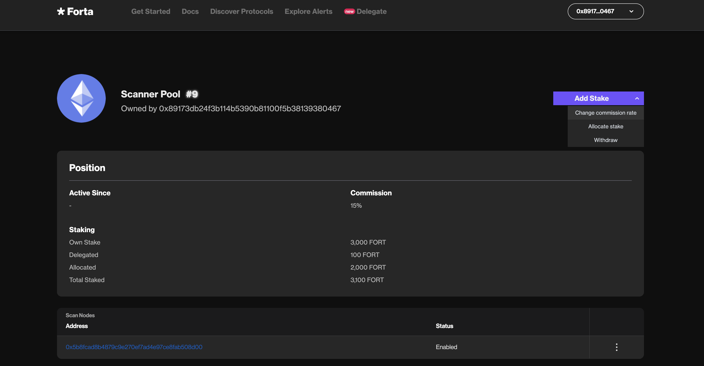

- Enter the commission that you would like to set on your pool

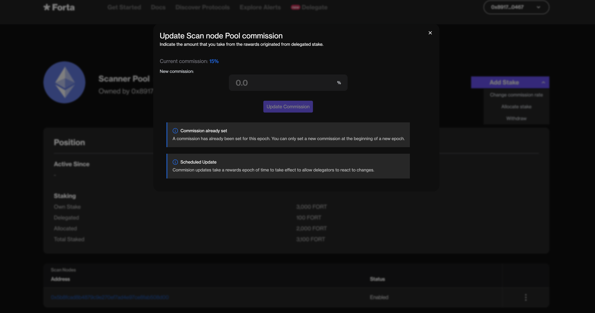
