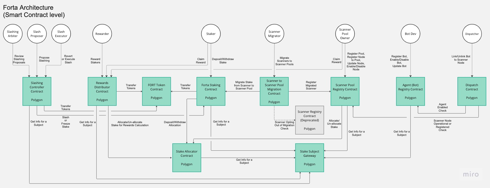

## Security - Design

Security starts in the design phase by incorporating strategies to disincentivize and mitigate malicious behaviors. As described in the [Forta Litepaper](../2022-7-11 Forta Litepaper.pdf), the primary guiding principles around the Forta protocol were:

- **Decentralization** - this not only applies to the network of independent scan nodes, but also to the detection bots that the community develops and the governance over the Network. This creates redundancies and increases the reliability of the network in case isolated failures occur.
- **Cryptoeconomic Incentives** - these incentives, like node and bot staking, encourage net positive behavior and disincentivize malicious behaviors.
- **Security Inheritance** - as the Forta Network is built on top of Ethereum and Polygon, its smart contracts inherit the security properties of those networks at the base layer.
- **Network Isolation** - isolation of network components from each other.

Further, the design of the Forta Network adopted three important security practices: (1) an assume-breach mentality, (2) an attacker mindset, and (3) looking at the protocol comprehensively from a security perspective. These three principles should be at the forefront of the Forta community's mind for any future changes to the Forta Network. Some of the questions that can be asked during the design phase are:

- What if a contributor is compromised?
- What if there is a malicious node or bot developer? What are they able to accomplish?
- What are the components beyond the smart contracts that need to be considered?
- Where are the community touch points and how could a compromise within that setting manifest?

As an example, the [Forta Litepaper](../2022-7-11 Forta Litepaper.pdf) detailed how those guiding principles and questions were incorporated into the original Forta Network design.

### Smart Contracts

The architecture of the Forta smart contracts can be seen in the below diagram.

