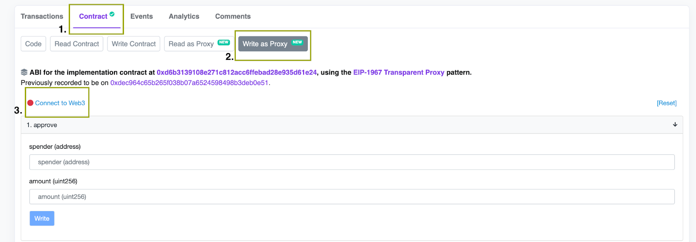
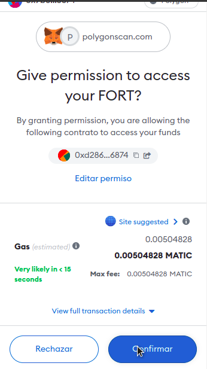

# Creating a Slashing Proposal.

Anyone that detects a slashable offence perpetrated by a Scan Node or Bot may report a Slash Proposal, if they meet the following requirements:

## Requirements.

- Have 1000 FORT bridged to Polygon, per proposal. ** This deposit can be slashed if the proposal does not follow appropiate formatting, it is malicious, false or spam**. Check the [slashing process](./slashing-process.md) for more info.
- Present verifiable evidence, in the form of screen captures, log files or any file that proves the accusations.
- Have knowledge of uploading files to IPFS.
- Is able to present evidence following Forta's the [Evidence Format](#evidence-format)
- Is able to interact with the SlashingController contract, either via [PolygonScan](https://polygonscan.com/) or interacting directly with the contracts via a web3 library and JSON RPC endpoint.


!!! warning "Proposal Deposit slashing"
    This deposit can be slashed if the proposal does not follow appropiate formatting and file limitations (see below), it is malicious, false or spam.
    Follow carefully this guide to follow correct conventions.


# 1. Preparing Evidence

Each case can have several files with evidence (logs, screenshots), and each evicende file should have an JSON file describing it, both hosted and pinned in IPFS.

Both evidence file and evidence descriptor must be downloadable during the Slash Proposal lifecycle, or the Slash Deposit might be slashed and the Slash Proposal not executed.

## File limitations

- Max file size, 500 Mbytes.
- Allowed extensions: .txt, .jpg, .jpeg, .png, .pdf, .webm, .mpg

Evidence description JSON:

```
{

    “fileURI”: string,
    “fileHash”: string,
    “fileTypeExtension”: string,
    “name”: string,
    “description”: string,
    “checksum”: string

}
```

- fileURI: IPFS URI of the evidence, example: “/ipfs/QmWQV5ZFFhEJiW8Lm7ay2zLxC2XS4wx1b2W7FfdrLMyQQc”
- fileHash: IPFS file hash, example: “QmWQV5ZFFhEJiW8Lm7ay2zLxC2XS4wx1b2W7FfdrLMyQQc”
- fileTypeExtension:”txt”, “pdf”, “png” or “jpg”
- fileName: name of the file
- description: description of what the evidence portrays. 500 char max.
- checksum: keccak256 hash of all the other concatenated key,value pairs of the JSON.

Example js script producing a evidence descriptor JSON:

```

const evidenceDescriptor = {
    fileURI: 'ipfs://bafybeihmnuxjiq4vd4r3ga3cebcn43o7v7nsovdn2n6rqis23dohcja72u/',
    fileHash: 'bafybeihmnuxjiq4vd4r3ga3cebcn43o7v7nsovdn2n6rqis23dohcja72u',
    fileTypeExtension: 'txt',
    fileName: 'logs',
    description: 'The logs provided in the file proves the Scanner Node 0x123 registered in Scanner Pool 456... is censuring the alerts from my bot',
    checksum: null,
};

const unhashedChecksum = Object.keys(evidenceDescriptor)
    .filter((key) => key !== 'checksum')
    .reduce((prev, key) => `${prev}${key}${evidenceDescriptor[key]}`, '');

evidenceDescriptor.checksum = ethers.utils.id(unhashedChecksum);
fs.writeFileSync('./evidence_1.json', JSON.stringify(evidenceDescriptor, null, 2));

```

And the resulting file:

```
{
  "fileURI": "ipfs://bafybeihmnuxjiq4vd4r3ga3cebcn43o7v7nsovdn2n6rqis23dohcja72u/",
  "fileHash": "bafybeihmnuxjiq4vd4r3ga3cebcn43o7v7nsovdn2n6rqis23dohcja72u",
  "fileTypeExtension": "txt",
  "fileName": "logs",
  "description": "The logs provided in the file proves the Scanner Node 0x123 registered in Scanner Pool 456... is censuring the alerts from my bot",
  "checksum": "0x7c2c3e9954d792269b84ee976c29153771886ddd81d4b4073bc5d3f0eb0a9099"
}
```

# 2. Approve FORT
1. Go to the [FORT token contract on Polygon](https://polygonscan.com/address/0x9ff62d1FC52A907B6DCbA8077c2DDCA6E6a9d3e1#writeProxyContract)
    1. Click on "Contract"
    2. Click on "Write as Proxy"
    3. Click on "Connect to Web3"
   

2. Approve the Slashing Controller contract address (0xTODO) to spend the amount for the slashing proposal deposit (1000 FORT in wei)

*spender*: 0x6927C25ff30ed86F86A863d987590A1d77509bDb

*amount*: 1000000000000000000000

   

3. Confirm the transaction<br>
   


# 2. Submitting Slash Proposal


## 2.1 Open SlashingController contract in Polyscan


1. Go to [SlashingController's Polyscan page](https://polygonscan.com/address/0x6927C25ff30ed86F86A863d987590A1d77509bDb#writeProxyContract),
    1. Click on "Contract"
    2. Click on "Write as Proxy"
    3. Click on "Connect to Web3"

2. Go to "7. ProposeSlash" and input your parameters:
    1. *_subjectType*: 1 for Detection Bot, 2 for Scanner Pool
    2. *_subjectId*: a Scanner Pool ID or Bot ID
    3. *_penaltyId*: The keccak256 hash of the slash reason, in uppercase separated by underscores.
        1. *MISCONDUCT_SLASH*: 0xe147df3b4755943b8e7219d7acfd0fd67879bdbf5f62537886a5e2acd476ee7d
        2. *OPERATIONAL_SLASH*: 0x602d37be0dfc88daa6b674e3c42ff4efabf3e86cef482bce18b643e8c0a1b33c
    4. *_evidence*: Array of IPFS file urls of the proposal's [evidence descriptor JSONs](#1-preparing-evidence) (at least 1, up to 5)

3. Click "Write" and Approve the transaction to submit the evidence.

4. Go to the transaction's page in Polyscan. Go to the 'Logs' Tab and look for the event 'SlashProposalUpdated'. The second parameter is your Slash Proposal ID.

## 3. Check Slash Proposal state

After submitting the proposal, the Slashing Arbiters will review it, possibly modifying the slash type or subject it targets (with new evidence).

To check the status of your proposal, you can:

1. Go to [SlashingController's Polyscan page](https://polygonscan.com/address/0x6927C25ff30ed86F86A863d987590A1d77509bDb#readProxyContract),
    1. Click on "Contract"
    2. Click on "Read as Proxy";

2. Go to "11. currentState", input your SlashProposal ID, and click Query.


The return value will be a number, here is the meaning (To learn more, see the [Slashing Policy](/slashing-policy))

0: _UNDEFINED_ (the Slash Proposal ID might be wrong, this Slash Proposal has not being created).

1: _CREATED_ (proposal just created and awaiting review, the stake of the subject id is frozen).

2: _REJECTED_ (proposal has been rejected by a Slashing Arbiter. The Slash Proposer's deposit has been sent to the treasury. Stake unfrozen).

3: _DISMISSED_ (proposal has been dismissed by a Slashing Arbiter. The Slash Proposer's deposit has been returned to the proposer. Stake unfrozen).

4: _IN_REVIEW_ (proposal being reviewed by a Slash Arbiter).

5: _REVIEWED_ (proposal is ready for a decission of the Slasher. The Slash Proposer's deposit has been returned to the proposer).

6: _EXECUTED_ (proposal executed, stake slashed and sent to the proposer and treasury, according to the current split parameters. Stake unfrozen).

7: _REVERTED_ (proposal not executed by Slasher. Stake unfrozen)
