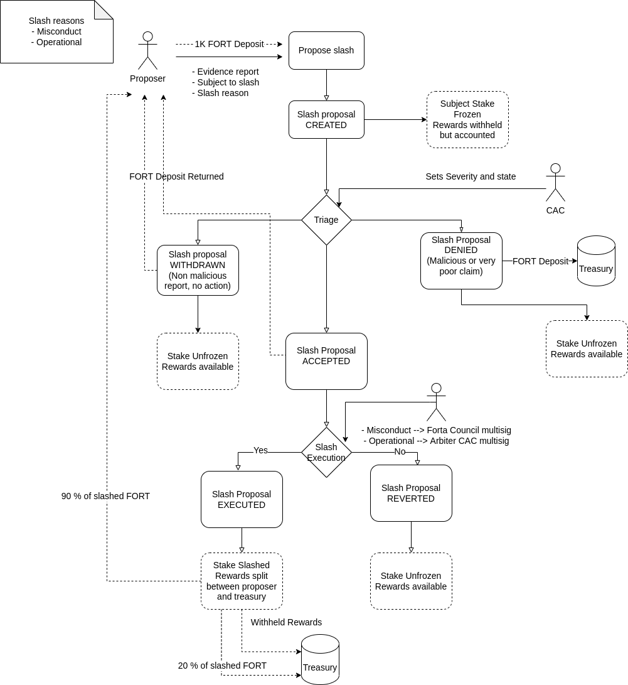

# Slashing Policy

## Slashing in the Forta Network

Both Scanner Pool Owners and Detection Bots are required to stake FORT tokens in order to participate in the Forta Network and earn FORT rewards. Delegated staking allows other Forta community members to stake tokens on node operations. Staking aligns incentives amongst Network participants and also acts as a sybil resistance mechanism. As a further security feature, Network participants also risk their staked FORT being slashed as follows:

- **Slashing Scanner Pool Owners.** Although the Forta work assignment algorithm takes into account SLA performance and pool owners that fail to execute their assigned work correctly should be organically pushed out of the Network over time, for additional reliability, Scanner Pool Owners are also subject to slashing if they fail to execute their assigned work correctly outside of the SLA factors or if they attempt misconduct.

- **Slashing Detection Bots.** Although Detection Bots are deployed via docker containers and must meet specific technical criteria in order to be assigned by the Forta work assignment algorithm, for additional reliability, Detection Bots are also subject to slashing if they fail to meet Detection Bot guidelines or negatively impact the Network, or attempt malicious behavior.

## Purpose of this Slashing Policy

In [FP-2](https://gov.forta.network/t/forta-proposal-2-fp-2-forta-bot-staking-and-developer-grants/480), FORT token holders approved the implementation of slashing architecture to further secure the Network, which includes the endowment of two protocol roles to one or more multisigs that have the power to determine the outcome of technical complaints in the Network:

1. **Arbiter Multisig(s)** - responsible for receiving, reviewing and resolving the outcome of complaints (in the form of Slashing Proposals) in the Forta Network 
2. **Slasher Multisig(s)** - responsible for approving and executing validated Slashing Proposals

Since certain parts of the slashing architecture are not yet expressed in smart contract code running on-chain, the purpose of this Slashing Policy is to establish norms that guide the actions of multisig signors beyond what is currently expressed on-chain. This policy presumes that any signor that does not comply with the norms laid out in this Slashing Policy will be replaced via decentralized governance.

The substance of this policy is intended to ensure that the Forta slashing architecture supports a healthy and robust Network where participants perform their work correctly, while minimizing the risk to honest participants of being economically penalized while interacting with the Forta Network in good faith.

## Forta Slashing Process

The entire Forta slashing process takes place on Polygon mainnet. If you need to bridge your FORT tokens from Ethereum to Polygon, check out this [guide](https://docs.forta.network/en/latest/bridging-fort/). Please carefully review the [Technical Slashing Guidance](https://docs.google.com/document/d/1edox-TLNUo3QpT2UFj73TbVOtGN1yoPT96ipzqW1voE/edit#bookmark=id.56u96ew8vlup) provided at the bottom of this page to submit a final Slashing Proposal.

## **I. PROPOSAL**

Any Proposer can submit an on-chain Slashing Proposal by following the Technical Slashing Guidance, which requires:

- the Proposer providing sufficient evidence substantiating the complaint against the Slashing Subject; and 
- the Proposer making a 1000 FORT token deposit.

The Proposer’s 1000 FORT deposit is at risk of being slashed if the Arbiter determines the Slashing Proposal does not conform to the requirements herein, or it is deemed malicious. Therefore, the Proposer must take care to submit sufficient verifiable evidence (e.g. screen captures, log files, or any other file that proves the accusations) in accordance with the formatting and file limitations set out in the Technical Slashing Guidance. Such evidence must remain publicly accessible through the entire slashing process. 

If a Slashing Proposal is ultimately validated and executed, the FORT tokens of the Slashing Subject **operator** targeted by the Slashing Proposal will be slashed and distributed as follows:

- 80% of slashed stake will go to the Proposer
- 20% of slashed stake will be returned to a community treasury at 0xC99884BE6eEE5533Be08152C40DF0464B3FAE877 on Polygon

## **II. ARBITER REVIEW**

The Arbiter is a protocol role responsible for receiving, reviewing and resolving technical complaints in the Forta Network. Following review of each Slashing Proposal, one of three possible outcomes will be determined by the Arbiter:

1. **Withdrawn Slashing Proposal** - *no parties are penalized*

    - Slashing Proposal is withdrawn from the slashing process by the Arbiter following review
    - 1000 FORT token deposit returned to Proposer; no stake slashed from Slashing Subject
    - e.g. Arbiter review surfaces additional evidence that renders Slashing Proposal complaint moot, or parties mutually agree to alternative resolution or withdraw complaint

2. **Denied Slashing Proposal**: *Proposer is penalized*

    - Slashing Proposal is denied as eligible by the Arbiter following review
    - 1000 FORT token deposit of Proposer is slashed to community treasury
    - e.g. Arbiter review determines Slashing Proposal was made in bad faith or did not contain accurate or sufficient evidence proving misconduct

3. **Validated Slashing Proposal** - *Slashing Subject is penalized*

    - Slashing Proposal is validated as eligible for slashing by the Arbiter following review and is classified as an “Operational” or “Misconduct” complaint as set out below
    - 1000 FORT token deposit returned to Proposer
    - e.g. Arbiter review determines Slashing Proposal was made in good faith and evidence is sufficient for Arbiter to determine outcome

Following receipt of a Slashing Proposal, the Arbiter shall make best efforts to determine the outcome of a Slashing Proposal within 10 days. All activity undertaken by the Arbiter pursuant to this policy will be published in the Discord channel [#slashing-proposals](https://discord.com/channels/869983523371642921/1033029398472962088) in advance of being executed on-chain, subject to redaction only where necessary to protect the security or integrity of the Forta Network. This disclosure should include the determination made by the Arbiter accompanied by the reasoning for reaching such a determination. 

## **III. EXECUTING VALIDATED SLASHING PROPOSALS**

The Arbiter address will confirm any Validated Slashing Proposal as either an “Operational” or “Misconduct” complaint, with the following consequences:

1. **Misconduct Complaint** - Slashing Subject at risk of up to 90% slash (if executed by Slasher Multisig). For example:

    - Censoring, forging or tampering with bots alerts
    - Forging or failing to provide performance metrics
    - Bot is part of an attack against Network or its participants
    - Any other evidenced misconduct in the Network
    - Bots whose alert misrepresents the purpose stated on their description or that fail to alert subscribers in the way they advertise
    - Any other evidenced operational failures in the Network

    The pool owner stake will be slashed by up to 90% of his staking in the scanner node.

    A percentage of 30% of the slashed amount to the pool owner will also be slashed from the delegated stake to that pool.

2. **Operational Complaint** - Slashing Subject at risk of up to 15% slash (if executed by Slasher Multisig). For example:

    - Scanner Pool Slashing Subject:
        - Failure to run a Node with the minimum technical requirements set out in the [Forta Docs](scan-node/introduction.md)
        - Failure to run a Node at expected quality standards not captured by the SLA calculation

        The pool owner stake will be slashed by up to 90% of his staking in the scanner node.

        A percentage of 30% of the slashed amount to the pool owner will also be slashed from the delegated stake to that pool.

    - Detection Bot Slashing Subject:
        - Bots that clog the network (spam)
        - Bots that inappropriately affect Scanner Node SLAs
        - Bots that demand an excessive amount of resources from Scanner Nodes

The on-chain rules are the ultimate authority of this logic, and in the case where the on-chain rules differ from this, it will prevail.

## **IV. EXECUTION OF SLASHING**

Following review and resolution of a Validated Slashing Proposal by the Arbiter as either “Operational” or **“Misconduct”**, a Proposal will be delivered to the following Ethereum addresses for final review and, if thought appropriate, execution of a Slashing Proposal:

**Misconduct Complaints** - the Forta Governance Council Multisig

**Operational Complaints** - the Arbiter Multisig

If the Arbiter alters the original classification of a Slashing Proposal from Malicious to Operational or vice-versa, it must provide evidence justifying such alteration on-chain and in Discord.

## Arbiter Multisig Delegation

Initially, the Arbiter role will be delegated by the Forta Governance Council to a 2-of-3 Gnosis Safe multisig dubbed the Community Arbitration Committee (the **“CAC”**). The CAC will determine if each Slashing Proposal is complete and being made in good faith, by investigating the evidence submitted and following up with stakeholders as necessary. Following review, the CAC will publish its determination and reasoning in the #slashing-proposals Discord channel and thereafter execute such decisions on-chain.

The initial members of the CAC include (Discord usernames, as found in [#slashing-proposals](https://discord.com/channels/869983523371642921/1033029398472962088)):

- ba3is#1622
- aomerkeser#3969
- 0xRoberto#8830

If members of the CAC do not stay aligned with the community and resolve disputes appropriately, the Forta community may lobby the Council to remove or replace a member, through an [FPP proposal](https://gov.forta.network/t/forta-proposal-process-v1-0/185) or directly.

*Conflicts of Interest*. Slashing Proposals could pose a conflict of interest due to a member of the CAC’s activities in the Forta Network. If any CAC member believes that they are conflicted with respect to a Slashing Proposal, they must disclose such conflict.

*Compensation*. Each member of the CAC shall receive 160 FORT for each Slashing Proposal reviewed and processed, paid by the Network monthly.

*Liability*. The only recourse for the CAC not fulfilling their duties under this Slashing Policy is to be replaced via the [Forta community governance process](https://forta.org/blog/governance/). The CAC has no legal or fiduciary responsibility to any stakeholder in the Forta Network and cannot be held responsible for any consequence that arises from Network participant behavior or any economic penalties incurred by stakeholders involved with the slashing process.

## TRANSPARENCY

All data related to staking and slashing in the Forta Network is publicly available on the Polygon network for review. In addition, all activity undertaken by the Arbiter pursuant to this policy will be published in the Discord channel #slashing-proposals in advance of being executed on-chain, subject to redaction only where necessary to protect the security or integrity of the Forta Network. This disclosure should include posting what decisions and classifications were made and a summary of the reasoning. Any Slashing Proposal decided upon by the Council will be published in Council minutes according to the Council Bylaws. 

# Illustrated process

