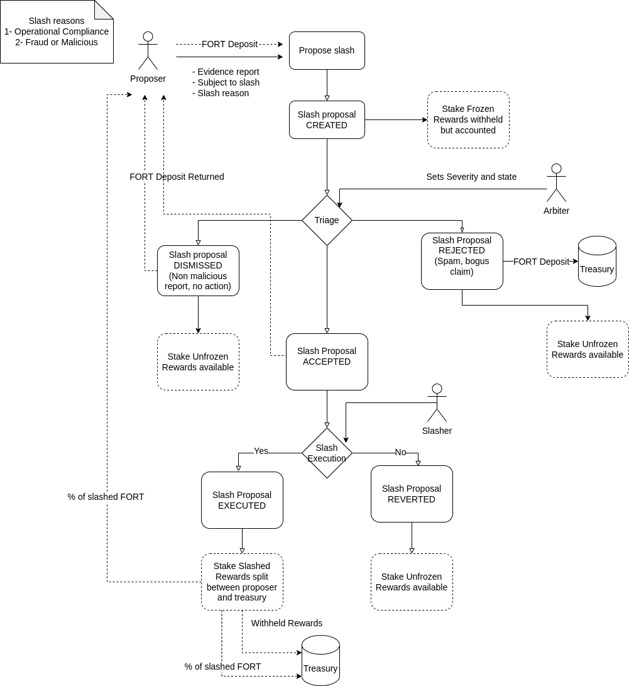

# Slashing Proposal Process

##  Roles

### Proposer:
Individuals or bots that detect evidence of a slashable offense and propose the slashing of a staking subject, assigning initial blame and reason for the proposal.

To have a public and permissionless proposal process, and since proposing a slashing freezes the stake of the suspect staking subject (bot or scanner), proposing cannot be free.

The Proposer would need to present a deposit of 1000 FORT for each proposal. This deposit is at risk of being sent to the treasury if the report is deemed in bad faith or too poorly constructed.

### Slashing Arbiter:
Technical reviewer of the slashing proposals. She needs to verify that:

1. The proposal is well constructed and in good faith. **If the proposal has merit, the deposit will be returned to the proposer. If not, the deposit will be sent to the slashing treasury.**

2. Investigate the evidence. Correct the blame and the reason if needed, presenting more evidence (for example the report blames a bot for not firing an alert, but it was the Scanner node’s fault).

3. Mark the proposal as ready for slashing.

At this point, due to the openness of the reports the verification of the evidence requires some manual processes and the Arbiters will be a committee named by the Governance Council, with appropriate expertise and without FORT incentives, with the committee further automating and decentralizing into the future.

### Slasher:

Decides to either:

- Execute the proposal, with the following effects:

-- Slashing the subject’s stake, with the tokens being split between the slashing treasury and the proposer, sending the withheld rewards back to the rewards pool.

-- Revert the slashing proposal, unfreeze the stake and assign the rewards being withheld.

Initially, we propose this role is granted to:

- The arbiter committee for partial slashes due to operational reasons.

- The Governance Council for major slashing proposals.

## Staking admin

Sets the parameters for staking and slashing.

- Slash reasons and penalty amounts.
- Amount of FORT deposit for proposals.
- % of the slashing amount going to the Proposer.
- Treasury address.

This role is initially assigned to the Council’s multisig, which will enact the results of Snapshot voting.
