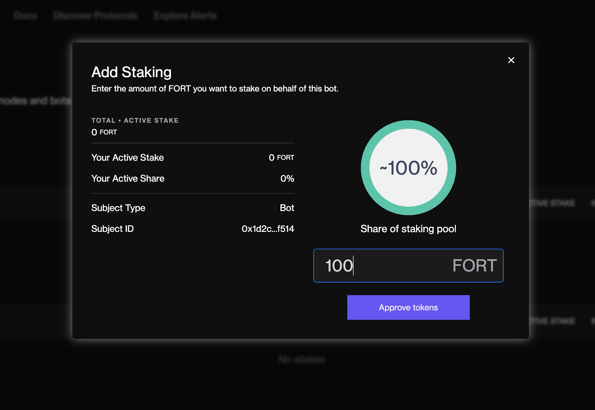
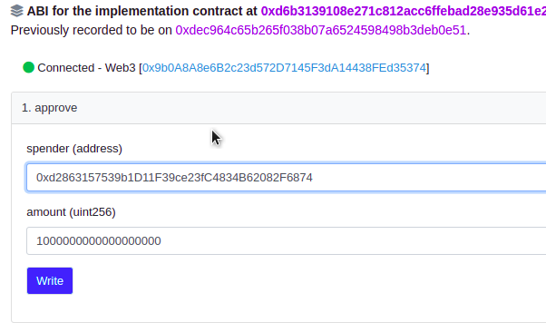
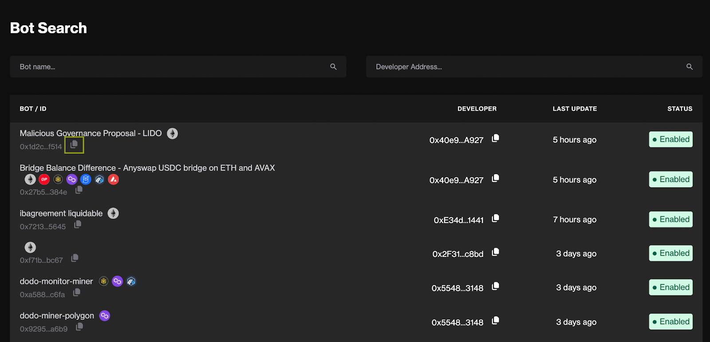
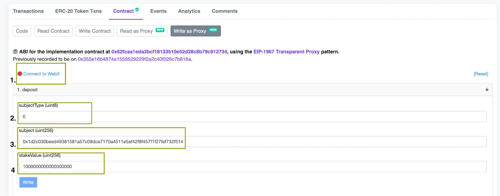
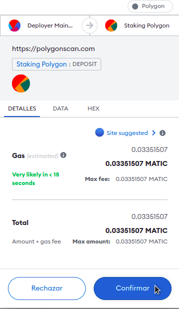

# Staking on Detection Bots

This page will describe how to stake on Forta Network detection bots. Staking on bots occurs on Polygon mainnet. If you need to bridge your FORT tokens from Ethereum to Polygon check out [this guide](bridging-fort.md). The minimum stake remains nil to provide maximum accessibility at the outset of permissionless operations.

## Staking using Forta Explorer (recommended)

1. Go to [https://explorer.forta.network/bot-search](https://explorer.forta.network/bot-search)
2. Search for the bot you want to stake on. In this example we are going to stake on a bot from Lido (but you can choose any bot you prefer).
3. Click on "Add Stake"
   
4. Enter the amount of FORT to stake on the bot.
   
5. Confirm the transaction
   

## Staking using Polygonscan
### Approve FORT

1. Go to the [FORT token contract on Polygon](https://polygonscan.com/address/0x9ff62d1FC52A907B6DCbA8077c2DDCA6E6a9d3e1#writeProxyContract)
    1. Click on "Contract"
    2. Click on "Write as Proxy"
    3. Click on "Connect to Web3"
   
2. Approve the Forta Staking contract address (0xd2863157539b1D11F39ce23fC4834B62082F6874) to spend a specified amount of FORT (in Wei units)
   
3. Confirm the transaction 
   

### Stake FORT

Once approved, you can search for a bot by name using Forta Explorer

1. Go to [https://explorer.forta.network/bot-search](https://explorer.forta.network/bot-search)
2. Search for the bot you want to stake on. In this example we are going to stake on a bot from Lido (but you can choose any bot you prefer). The bot ID can be found on the Bot Report Page specific to each bot on Forta Explorer
    1. Search for the bot
    2. Copy the bot ID
   
3. Go to the [Forta Staking contract page](https://polygonscan.com/address/0xd2863157539b1D11F39ce23fC4834B62082F6874#writeProxyContract)
    1. Click on "Connect to Web3"
    2. In the "deposit" section, enter 1 for the "subjectType" field
    3. Enter the bot ID you copied from Forta Explorer in the "subject" field
    4. Enter the amount of FORT to stake (in Wei units) in the "stakeValue" field
   
4. Confirm the transaction 
   
