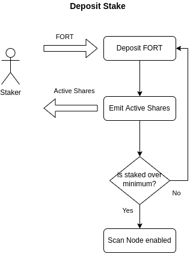
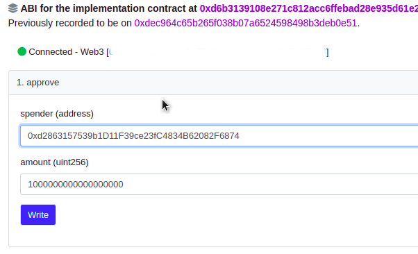
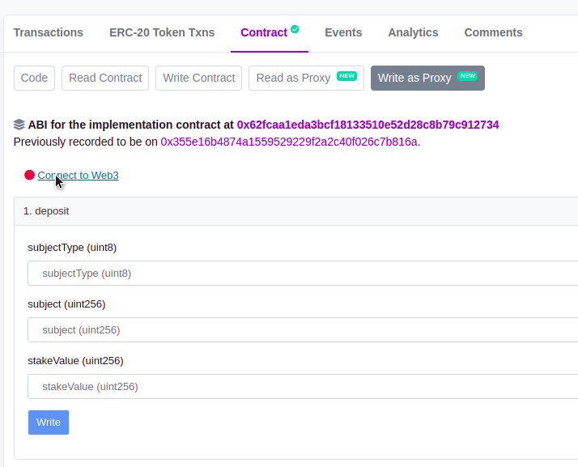
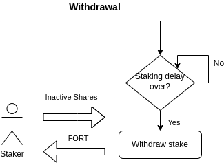
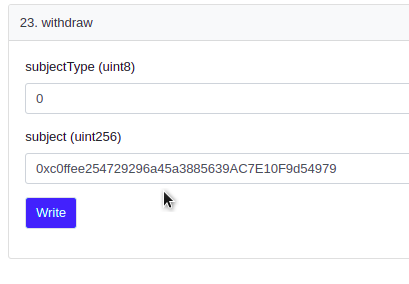

# Staking on Scan Nodes

To be a part of the Forta Network, a scan node should have at least **500 FORT** of active stake staked on its behalf.

!!! important "Minimum Stake Threshold"
    This value is subject to change and can be different per chain in the future.

The staking state is signaled by the ownership of ERC1155 shares emitted by the staking contract. There are two kinds of shares:

- **Active shares** represent active stake and are counted for security. They are minted when depositing stake. These shares are transferrable.
- **Inactive shares** represent inactive stake and are not counted for security. They are minted when `initiateWithdrawal()` is executed. These shares are non-transferrable. After _staking delay_, these shares can be burned to get the staked FORT back.

!!! warning "Staking and Rewards"
    Staking more than the minimum in a scan node does not affect the rewards in any way.

Again, please keep in mind that **the values and parameters are subject to change.**

!!! warning "Staking Delay"
    A withdrawal consists of two steps: initiating a withdrawal and withdrawing. For security reasons, there is a _staking delay_ between initiation and the actual withdrawal. **This delay is currently 10 days** and is subject to change in the future.

## Depositing stake

Deposit FORT to get active shares.

### Staking using Polyscan

#### Approve FORT

1. Go to FORT token contract page, [section _Write as Proxy_](https://polygonscan.com/address/0x9ff62d1FC52A907B6DCbA8077c2DDCA6E6a9d3e1#writeProxyContract)

2. Connect your scan node owner wallet and make sure that you have selected the Polygon network. 

3. Approve the amount you would like to stake. This amount needs to be higher than the minimum threshold mentioned before.

    - **spender:** `FortaStaking` contract address: `0xd2863157539b1D11F39ce23fC4834B62082F6874`

    - **amount:** FORT amount, in wei. FORT has 18 decimals like Ether, so the FORT amount should be followed by 18 zeroes. If you are unsure, you can use a converter like [https://eth-converter.com/](https://eth-converter.com/). 

4. Click _Write_ and approve the transaction in your wallet.

#### Stake FORT

You can stake only on the registered scan nodes.

1. Go to Forta staking contract page, [section _Write as Proxy_](https://polygonscan.com/address/0xd2863157539b1D11F39ce23fC4834B62082F6874#writeProxyContract)

2. Connect your scan node owner wallet and make sure that you have selected the Polygon network. 

3. Go to `1. deposit` to stake and input the folowing:

    - **subjectType:** 0

    - **subject:** Your scan node address **(not the owner address).**

    - **stakeValue:** Amount of FORT to stake. For a new node, input `500000000000000000000` (500 FORT in wei). If you are unsure, you can use a converter like [https://eth-converter.com/](https://eth-converter.com/). 

4. Click _Write_ and approve the transaction in your wallet.

## Initiating a stake withdrawal

!!! warning "This is a withdrawal action!"
    If you have visited this page to deposit on your new node and executed the deposit step already, please keep in mind that you inactivate your stake by doing `initiateWithdrawal()` and your node becomes disabled.

When this action is executed (`initiateWithdrawal()`), active stake becomes inactive i.e. active shares are burned and inactive shares minted.

After _staking delay_ is over, you will be able to `withdraw()` FORT, as described in the next section.

!!! note "Permissions"
    Only active share holders can init withdrawal. This means you have earned 500 FORT or more in a week during Fortification Phase, thus received staking shares.

### Initiate the withdrawal using Polyscan

1. Go to Forta staking contract page, [section _Write as Proxy_](https://polygonscan.com/address/0xd2863157539b1D11F39ce23fC4834B62082F6874#writeProxyContract)

2. Connect your scan node owner wallet and make sure that you have selected the Polygon network. 

3. Go to `4. initiateWithdrawal` and input the folowing:

    - **subjectType:** 0

    - **subject:** Your scan node address **(not the owner address).**

    - **stakeValue:** Amount of shares to unstake, in wei. If the node has not been slashed, the proportion is `1 Share : 1 FORT`. If you are unsure about the amount in wei, you can use a converter like [https://eth-converter.com/](https://eth-converter.com/). 

4. Click _Write_ and approve the transaction in your wallet.

5. After confirmation, the _staking delay_ starts. If the current active shares are under minimum stake threshold, the node enters into disabled state.

## Withdrawal

Burn inactive shares after _staking delay_ to get staked FORT.

### Withdrawal using Polyscan

1. When the _staking delay_ is over, go to Forta staking contract page, [section _Write as Proxy_](https://polygonscan.com/address/0xd2863157539b1D11F39ce23fC4834B62082F6874#writeProxyContract)

2. Connect your scan node owner wallet and make sure that you have selected the Polygon network. 

3. Go to `4. initiateWithdrawal` and input the folowing:

    - **subjectType:** 0

    - **subject:** Your scan node address **(not the owner address).** 

4. Click _Write_ and approve the transaction in your wallet.

5. When the transaction is confirmed, you will receive the FORT amount you specified.
