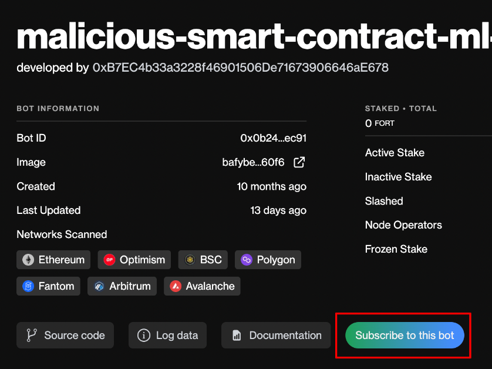
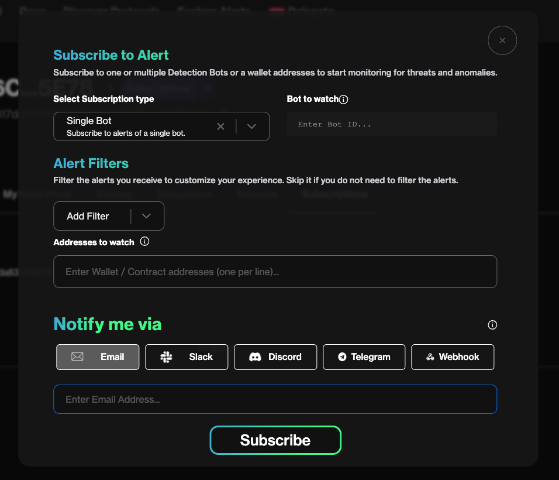
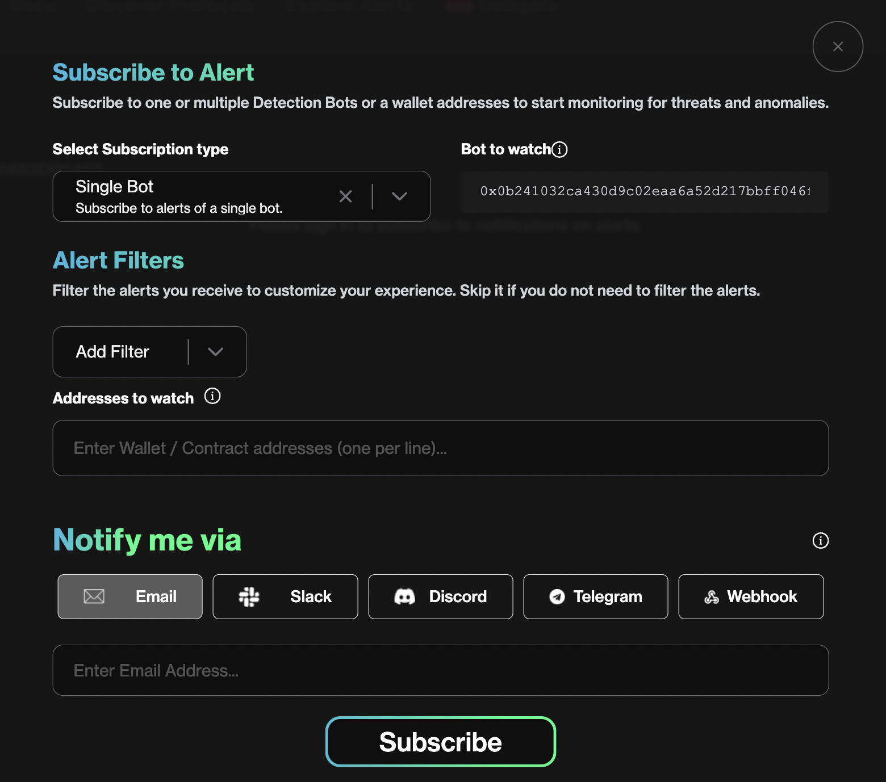

# Subscribing to Alerts 

The Forta Network allows users to access the intel generated by detection bots through a variety of methods. Intel can be accessed through the GraphQL API (pull) or by subscribing to a bot directly (push) and receiving notifications via email, Slack, Telegram, Discord or webhooks. Purchasing one or more network subscriptions will give users access to both. 

Here’s a step-by-step guide to subscribing directly to a bot:

 ## Subscribing from the Bot’s Profile Page

Step 1: Click on the bot you want to subscribe to. When you’re on the bot’s profile page, click on the “Subscribe to this bot” button. 

Step 2: After you click “Subscribe to this bot”, you will be redirected to the Forta App and prompted to sign in to your Metamask Wallet.  
 
Step 3: Once you’ve connected your wallet, the new window will appear with the Bot ID pre-filled. You will have the option to add custom filters (e.g. by address), and be asked to select your preferred notification channel (Slack, Telegram, Email, Discord or Webhook). 

Step 4: When you’ve made your selections, click “Subscribe”. Depending on how active the bot is, you may start receiving alerts within a few minutes. 

## Subscribing to a Bot from the Forta App

Step 1: Navigate to [https://app.forta.network/](https://app.forta.network/) and connect your wallet. 

Step 2: Click on your wallet address in the top right corner in order to reveal a dropdown menu and click on ‘My Subscriptions’.

Step 3: Here you can manage your list of different subscriptions. If this is your first time setting up a subscription, you will need to click on the purple ‘Add Subscription’ button and a window will appear. 

Step 4: Here you will be able to enter the bots or addresses you want to receive real time updates on and the method in which you would prefer to receive them. Simply add a Bot ID in order to receive alerts generated by a specific bot or add an EOA or contract address in order to receive any real time intel generated on those entities by the Forta Network. 