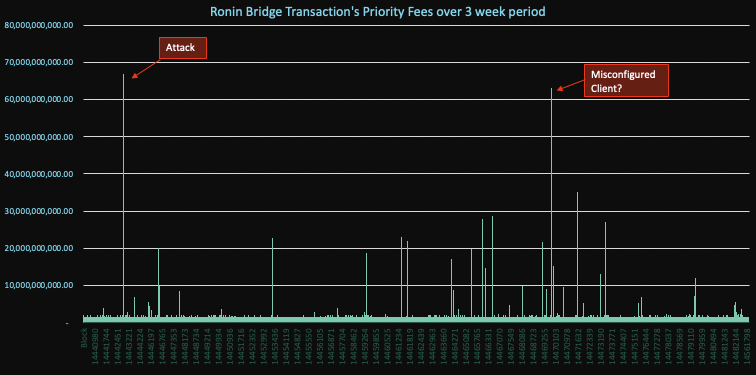
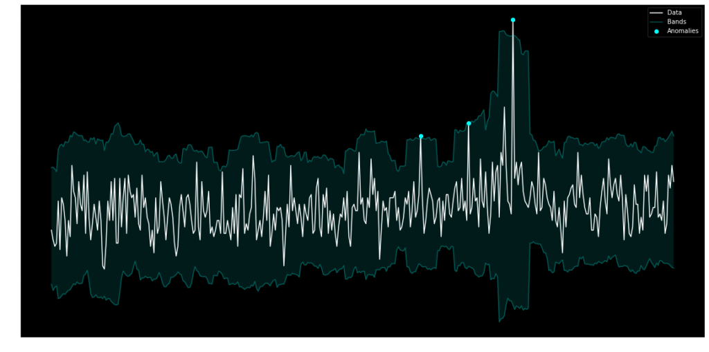
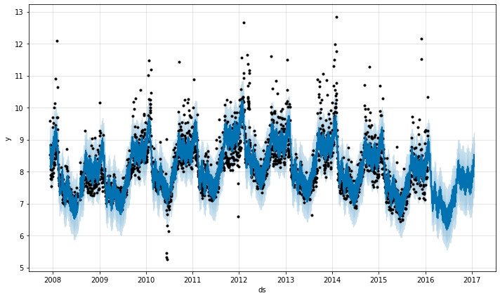

# Time Series Analysis

Detection bots can be heuristic based and this often works just fine. In order, for instance, to monitor whether an account is funded by a privacy protocol, like Tornado Cash and then interacts with your protocol, you monitor funding transactions, maintain state of those funded accounts, and emit a finding when that account interacts with a protocol (Tornado Cash Funded Account Interaction).

The approach, however, does not work well when the event itself is frequent or constantly present, such as a transaction’s gas price? What is a good threshold to choose? Is a priority fee of 2 a good value? 5? 50? Further, what if it changes over time and depends on the underlying protocol’s usage pattern? This may be just the nature of the protocol (some competitive aspect, like a hot NFT project where people frequently are eager to see their transaction mined quickly, so they are willing to pay higher gas to get picked up by the miners). In those instances, we see frequent spikes in gas prices that could even be seasonal (e.g. NFTs get minted every Monday), so we would expect spikes on Mondays as part of the normal course of business. If, however, we have a protocol where such seasonal patterns do not exist, gas price spikes would be rare and a spike in the future may indicate something truly unusual, such as an attack. 

The recent Ronin attack illustrates this: We do see many spikes in priority fees over time, but the attacker transaction clearly sticks out. A hard threshold approach will likely raise a lot of unnecessary findings. This is where time series anomaly detection comes in. A time series buckets numeric values (e.g. counts or absolute values) over time



A time series detection approach learns the historical variability as well as seasonality that may be represented in the data (e.g. gas priority fees may be higher on weekdays than on weekends). It learns a band or range and alerts when a value breaks out of the expected range:


Source: https://medium.com/@krzysztofdrelczuk/time-series-anomaly-detection-with-python-example-a92ef262f09a 

To create a time series model in Python, the [Prophet Library](https://facebook.github.io/prophet/docs/quick_start.html) is a good choice. A simple model can be created by querying alerts from other detection bots or hold the timeline data in the bot directly. The following code block creates a model:

```python
import pandas as pd
from prophet import Prophet

df = pd.read_csv('../examples/example_wp_log_peyton_manning.csv')  # from https://github.com/facebook/prophet/blob/main/examples/example_wp_log_peyton_manning.csv
m = Prophet()
m.fit(df)

future = m.make_future_dataframe(periods=365)
forecast = m.predict(future)  # 'ds', 'yhat', 'yhat_lower', 'yhat_upper'
```

The image below shows a visualized timeline including the forecasted range. Each dot represents a data point of the time series. The bands represent the prediction of the model (as per the yhat_lower and yhat_upper values of the forcast model above). The dots falling outside of the prediction represent anomalous data points, which a detection bot can alert on.



For more information around time series analysis and how to implement both in JavaScript or Python, please refer to the [Time Series Analysis with Forta blog post](https://forta.org/blog/time-series-analysis-with-forta/).