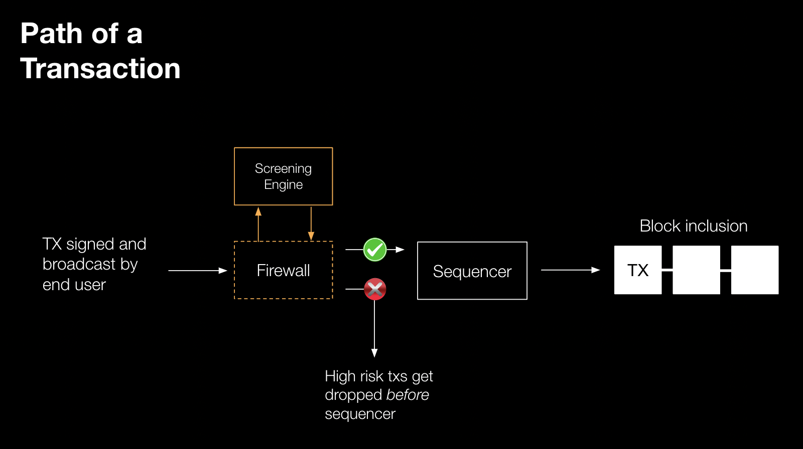

## What is Forta Firewall?

**Forta Firewall** detects and blocks malicious transactions before execution. Firewall integrates into the transaction flow and stops malicious transactions before they are included in a block.

It can be leveraged by rollups and protocol teams to screen transactions in real-time for security and compliance risks.

### For Rollups

For the case of rollups, Forta works with a rollup’s RaaS provider to route transaction activity to Firewall for screening. High-risk transactions are flagged and filtered out before they get to the sequencer.

### For Protocols

For protocols, Firewall integrates at the smart contract level to require that specified transactions are accompanied by an on-chain attestation that indicates that the transaction went through automated security checks. Transactions that are flagged as high risk do not receive attestations and will revert on-chain.

Below you can find a demo showing how Forta Firewall blocks an attack transaction targeting a vulnerable smart contract

<iframe width="560" height="315" src="https://www.youtube.com/embed/bxujLYcC6sg?si=CR515p3YI2CMv132" title="YouTube video player" frameborder="0" allow="accelerometer; autoplay; clipboard-write; encrypted-media; gyroscope; picture-in-picture; web-share" referrerpolicy="strict-origin-when-cross-origin" allowfullscreen></iframe>

 

### Censorship-Resistance

For censorship-resistance, transactions flagged as high risk are not permanently blocked, but delayed, with details revealed only to the Firewall user and giving them time to respond.
