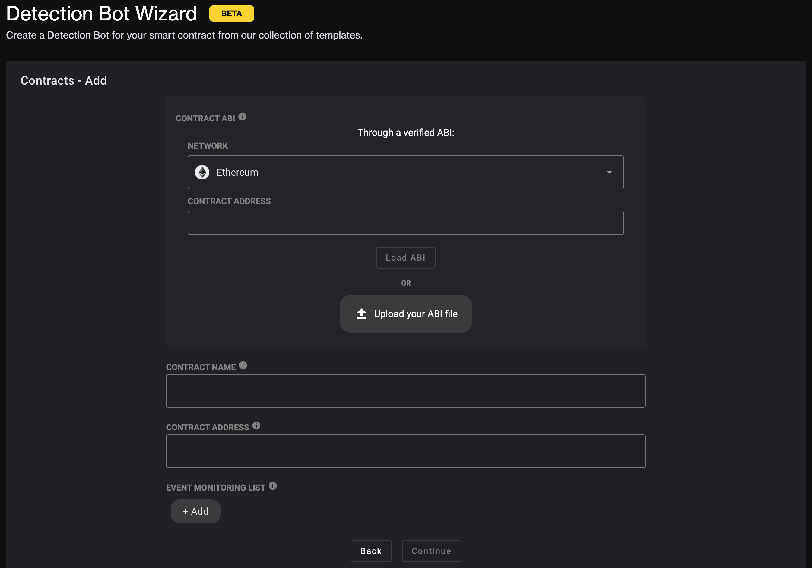
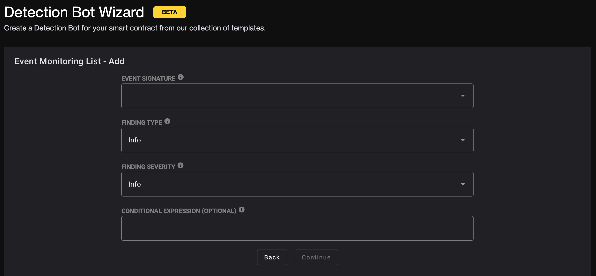
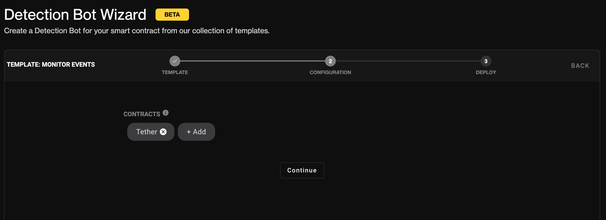
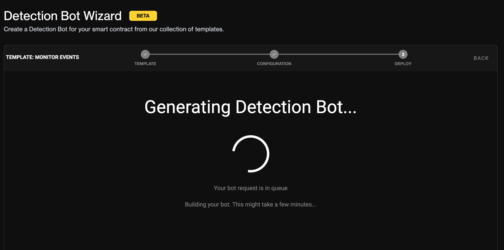

# Detection Bot Wizard

With the [Forta Detection Bot Wizard](https://app.forta.network/wizard), anyone can deploy a detection bot to scan for conditions they are interested in. The wizard provides a convenient UI that does not require writing any code. Simply select what type of detection bot you want, configure it to your needs, and deploy it using the existing [Forta App](https://app.forta.network). You can check out the video walkthrough for the wizard here:

<iframe width="560" height="315" src="https://www.youtube.com/embed/i5uz19dP5xQ?start=287" title="YouTube video player" frameborder="0" allow="accelerometer; autoplay; clipboard-write; encrypted-media; gyroscope; picture-in-picture" allowfullscreen></iframe>

The rest of this page will guide you through deploying a detection bot using the wizard UI. In this example, we will deploy a bot that alerts when there is a Tether transfer of more than 100,000 USDT.

## Select a template

Start by navigating to the [wizard](https://app.forta.network/wizard) and ensure you are signed in using your wallet. You will see a dropdown of templates you can choose from. For this example, we will select the "Monitor Events" template:

Once selected, you can click the "View source code" link if you would like to see the template code. Click the "Continue" button to move on to configuring the template.

## Configure the template

Each template will have its own unique configuration form. For this template, we need to specify which contract(s) to monitor as well as which event(s) from that contract we are interested in being notified about. You should see a form that looks like this:

### Select the contract

Click the "+ Add" button to specify the contracts you are interested in. The form should look like the following:

You can select any of the chains supported by Forta. For this example we want Ethereum since that is where the main Tether contract is deployed. You can then specify the ABI of the contract by providing its address and loading it automatically, or by manually uploading an ABI file. Paste the Tether contract address (0xdac17f958d2ee523a2206206994597c13d831ec7) into the first "Contract Address" field and click the "Load ABI" button (it should say "Loaded" once complete). Lastly, provide a name for the contract in the "Contract Name" field (e.g. "Tether").

### Select events

Now that the contract is specified, we need to tell the wizard which events we are interested in. Click the "+ Add" button under the "Event Monitoring List" label. This should bring you to a form that looks like this:

You can select the event you are interested in from the "Event Signature" dropdown. For this example, we are interested in the Transfer events. The "Finding Type" and "Finding Severity" dropdowns allow you to specify a categorization of the alert that will fire. This will depend on your specific usecase, but for this example we leave them to the default values of "Info".

Lastly, there is an optional field called "Conditional Expression" where we can specify further conditions that the event should meet (i.e. the transfer value being higher than some amount). Since we want Transfer events over 100,000 USDT, we will enter `value > 100000000000`. Notice that the left hand side of the expression **matches the event parameter name from the "Event Signature" field**. Also, notice that the right hand side of the expression is **specified in base units of Tether which has 6 decimal places (this can vary per token)**.

Click the "Continue" button to confirm the event configuration. And then click "Continue" again to confirm the contract configuration.

## Build the detection bot

Now that the template is configured, we can proceed to building the detection bot. The completed configuration form should look like this:

To begin building the bot, click the "Continue" button. You should then see a loading spinner like the following:

The detection bot should take less than one minute to generate. Once the process is complete, you should see a success message like this:

The resulting output of the build process will be a Docker image reference. To continue to deploy the detection bot through the Forta App, click the "Deploy Bot" button. Alternatively, you could also copy the Docker image reference to your clipboard if you wanted to deploy later. The Docker image reference would be in the format `bafybeid3vhcgruv47e4hy5texnq5ux4foi6th3cmjzeemzxt3ckir6jjjq@sha256:9464461cc98e49a25eb2dd7eead2ac098c19bc09642be89f37cb9b88d349f7cd`

## Deploy the detection bot

After clicking the "Deploy Bot" button, you will be redirected to the detection bot deployment form:

Some of the fields will be prepopulated, specifically the "Docker Image" field will contain the image reference of the bot you just generated. Continue to fill out the remaining fields and then deploy the bot.

## Subscribing to alerts

After your bot is deployed, you can view the alerts it generates using [Forta Explorer](https://explorer.forta.network/). You can search by your bot's ID or a contract address. Alternatively, you can query for alerts programmatically using the [Forta API](api.md). To learn more about subscribing to alerts, check out [this section](subscribing.md).

## Maintaining your bot

You may need to update your bot code at some point in the future, view its logs or even disable it. To learn more about maintaining your bot, check out [this section](maintaining.md).